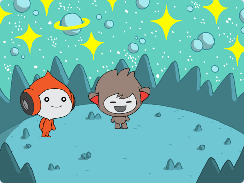

## Nano troca de fantasias

<div style="display: flex; flex-wrap: wrap">
<div style="flex-basis: 200px; flex-grow: 1; margin-right: 15px;">

Faça Nano expressar seus pensamentos ou sentimentos através de gestos e expressões faciais trocando de **fantasias**.

Atores têm **fantasias** para mudar sua aparência. They are usually slightly different images of the same sprite. Para animar um ator, você pode alterar sua fantasia.

</div>
<div>

{:width="300px"}

</div>
</div>

--- task ---

Adicione o ator **Nano** ao seu projeto selecionando da categoria **Imaginários**.


--- /task ---

--- task ---

Verifique se o ator **Nano** esteja selecionado na lista de Atores abaixo do Palco.


Clique na guia **Código** e adicione um código para que o ator **Nano** diga 'Obrigado' usando `mude para a fantasia`{:class="block3looks"} e `espere`{:class="block3control"}: Use the drop down menu to switch between `nano-b`{:class="block3looks"} and `nano-a`{:class="block3looks"}:


```blocks3
when this sprite clicked // quando o Nano é clicado
switch costume to [nano-b v] // Nano falando
wait (0.5) seconds // tente 0.25 em vez de 0.5
switch costume to [nano-a v] // Nano sorrindo
```
--- /task ---

**Dica:** Todos os blocos são codificados por cores, assim você vai encontrar o bloco `mude para a fantasia`{:class="block3looks"} no menu de blocos `Aparência`{:class="block3looks"} e o bloco `espere`{:class="block3control"} no menu de blocos `Controle`{:class="block3control"}.

--- task ---

**Teste:** Clique no ator **Nano** no Palco e verifique se o balão de fala aparece e se a fantasia de Nano muda.

--- /task ---
