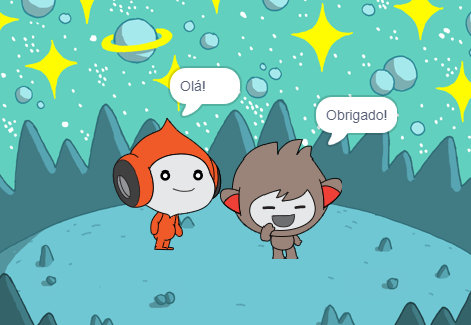
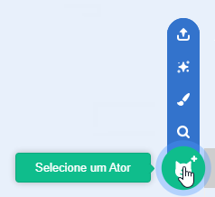
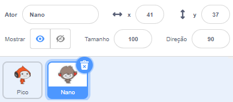
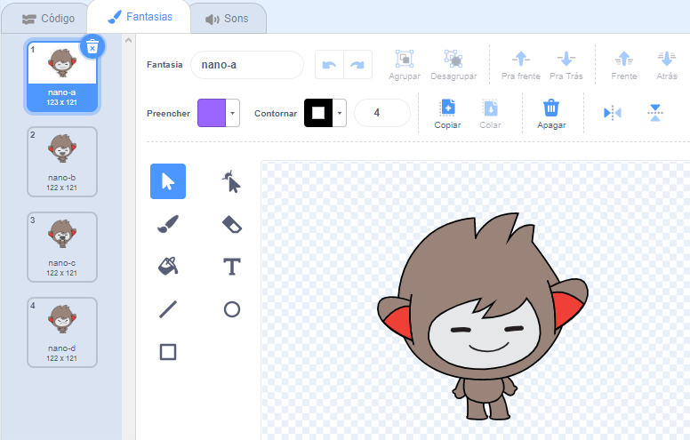
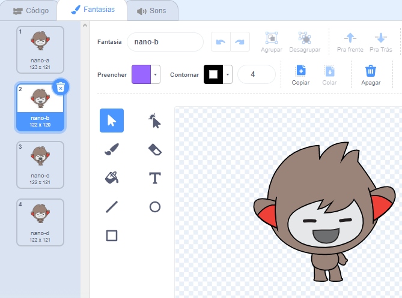
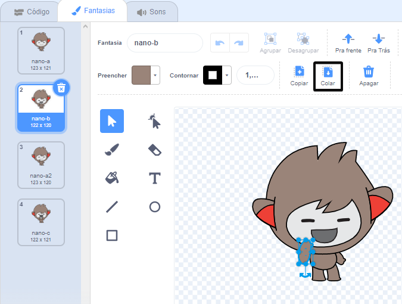

## Nano switches costume

<div style="display: flex; flex-wrap: wrap">
<div style="flex-basis: 200px; flex-grow: 1; margin-right: 15px;">

Get Nano to emote by switching **costumes**.

Atores têm **fantasias** para mudar sua aparência. To animate a sprite, you can change its costume.

</div>
<div>

{:width="300px"}

</div>
</div>

### Nano signs "Thanks!"

--- task ---

Adicione o ator **Nano** ao seu projeto selecionando da categoria **Imaginários**.



--- /task ---

--- task ---

Verifique se o ator **Nano** esteja selecionado na lista de Atores abaixo do Palco.




Click on the **Code** tab and add a script to get the **Nano** sprite to sign 'Thanks' using `switch costume to`{:class="block3looks"} and `wait`{:class="block3control"}:


```blocks3
when this sprite clicked // when Nano is clicked
switch costume to [nano-b v] // Nano talking
wait (0.5) seconds // try 0.25 instead of 0.5
switch costume to [nano-a v] // Nano smiling
```
--- /task ---

**Tip:** All the blocks are colour-coded, so you will find the `switch costume to`{:class="block3looks"} block in the `Looks`{:class="block3looks"} blocks menu and the `wait`{:class="block3control"} block in the `Control`{:class="block3control"} blocks menu.

--- task ---

**Test:** Click on the **Nano** sprite on the Stage and check that Nano's costume changes.

--- /task ---

### Nano usa linguagem de sinais

<p style="border-left: solid; border-width:10px; border-color: #0faeb0; background-color: aliceblue; padding: 10px;">Milhões de pessoas usam a linguagem de sinais para se comunicar. A common way to sign 'Thank you' is to place your fingers on your chin with your hand as flat as possible. You then move your hand forwards, away from your chin and slightly down. 
</p>

<!-- Add a video of someone signing -->

Nano usará linguagem de sinais trocando de fantasia.

Você pode editar as fantasias para seus atores com o editor de pintura. Você editará uma fantasia de Nano para que eles assinale "obrigado".

--- task ---

Clique na aba **Fantasias** para ver as fantasias para o ator **Nano**:



--- /task ---

--- task ---

Clique na fantasia **nano-b**. Clique no braço do lado esquerdo da tela e, a seguir, clique em **Apagar**.


A fantasia deve ficar assim:



--- /task ---

**Dica:** Se você cometer um erro no editor do Paint, pode clicar em **Desfazer**.


--- task ---

Vá para a **nano-c** e clique no braço do lado esquerdo da tela, depois clique em **Copiar**.



--- /task ---

--- task ---

Volte para a fantasia **nano-b** e clique em **Colar**. A fantasia deve ficar assim:


--- /task ---

--- task ---

**Teste:** Clique no ator **Nano** no Palco e verifique se o balão de fala aparece e a fantasia de Nano muda para a fantasia que você editou.

--- /task ---

<p style="border-left: solid; border-width:10px; border-color: #0faeb0; background-color: aliceblue; padding: 10px;">Você aprendeu a fazer o sinal de "obrigado". Da próxima vez que você agradecer a alguém, por que não usar sua nova habilidade?
</p>

