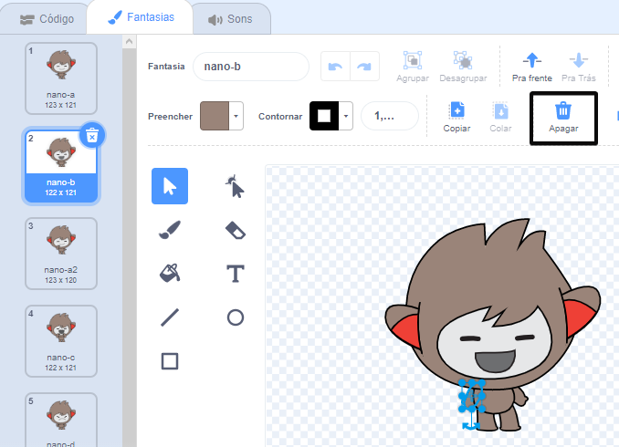

## Nano troca de fantasias

<div style="display: flex; flex-wrap: wrap">
<div style="flex-basis: 200px; flex-grow: 1; margin-right: 15px;">

Faça Nano expressar seus pensamentos ou sentimentos através de gestos e expressões faciais trocando de **fantasias**.

Atores têm **fantasias** para mudar sua aparência. Para animar um ator, você pode alterar sua fantasia.

</div>
<div>

{:width="300px"}

</div>
</div>

### Nano diz "Obrigado!"

--- task ---

Adicione o ator **Nano** ao seu projeto selecionando da categoria **Imaginários**.


--- /task ---

--- task ---

Verifique se o ator **Nano** esteja selecionado na lista de Atores abaixo do Palco.


Clique na guia **Código** e adicione um código para que o ator **Nano** diga 'Obrigado' usando `mude para a fantasia`{:class="block3looks"} e `espere`{:class="block3control"}:


```blocks3
when this sprite clicked // quando o Nano é clicado
switch costume to [nano-b v] // Nano falando
wait (0.5) seconds // tente 0.25 em vez de 0.5
switch costume to [nano-a v] // Nano sorrindo
```
--- /task ---

**Dica:** Todos os blocos são codificados por cores, assim você vai encontrar o bloco `mude para a fantasia`{:class="block3looks"} no menu de blocos `Aparência`{:class="block3looks"} e o bloco `espere`{:class="block3control"} no menu de blocos `Controle`{:class="block3control"}.

--- task ---

**Teste:** Clique no ator **Nano** no Palco e verifique se o balão de fala aparece e se a fantasia de Nano muda.

--- /task ---

### Nano usa linguagem de sinais

<p style="border-left: solid; border-width:10px; border-color: #0faeb0; background-color: aliceblue; padding: 10px;">Milhões de pessoas usam a linguagem de sinais para se comunicar. Uma forma comum de dizer 'Obrigado' é colocar os dedos no queixo com a mão o mais espalmada possível. Você então move a mão para frente, longe do queixo e ligeiramente para baixo. 
</p>

Nano usará linguagem de sinais trocando de fantasia.

Você pode editar as fantasias para seus atores com o editor de pintura. Você editará uma fantasia de Nano para que eles assinale "obrigado".

--- task ---

Clique na aba **Fantasias** para ver as fantasias para o ator **Nano**:


--- /task ---

--- task ---

Clique na fantasia **nano-b**. Clique no braço do lado esquerdo da tela e, a seguir, clique em **Apagar**.



A fantasia deve ficar assim:


--- /task ---

**Dica:** Se você cometer um erro no editor do Paint, pode clicar em **Desfazer**.


--- task ---

Vá para a **nano-c** e clique no braço do lado esquerdo da tela, depois clique em **Copiar**.


--- /task ---

--- task ---

Volte para a fantasia **nano-b** e clique em **Colar**. A fantasia deve ficar assim:


--- /task ---

--- task ---

**Teste:** Clique no ator **Nano** no Palco e verifique se o balão de fala aparece e a fantasia de Nano muda para a fantasia que você editou.

--- /task ---

<p style="border-left: solid; border-width:10px; border-color: #0faeb0; background-color: aliceblue; padding: 10px;">Você aprendeu a fazer o sinal de "obrigado". Da próxima vez que você agradecer a alguém, por que não usar sua nova habilidade?
</p>
