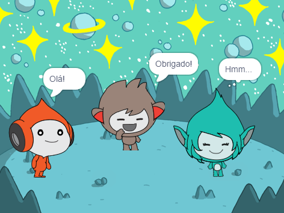

## Giga muda de cor

<div style="display: flex; flex-wrap: wrap">
<div style="flex-basis: 200px; flex-grow: 1; margin-right: 15px;">
Atores também podem usar balões de pensamento e mudar as cores para mostrar sua personalidade. Você conseguirá que Giga faça isso.
</div>
<div>

{:width="300px"}

</div>
</div>

### Make Giga change colour

--- task ---

Adicione o ator **Giga**.

Arraste o ator **Giga** para posicioná-lo no lado direito do Palco.

--- /task ---

--- task ---

Certifique-se de ter o ator **Giga** selecionado na lista de Atores abaixo do Palco. Adicione este código para fazer o **Giga** se comunicar mudando de cor:


```blocks3
when this sprite clicked
set [color v] effect to [0] // 0 is the starting colour
think [Hmm...] for [2] seconds 
clear graphic effects // back to the starting colour
```

--- /task ---

**Dica:** Clique no ator na lista de Atores abaixo do Palco antes de adicionar ou alterar o código, fantasia ou som. Certifique-se de ter clicado no ator correto.

--- task ---

Tente números diferentes de `1` a `200` no bloco `defina o efeito cor como`{:class="block3looks"} até encontrar uma cor de sua preferência.

--- /task ---

--- task ---

Altere as palavras e o número de segundos no bloco `pense`{:class="block3looks"}.

--- /task ---

--- task ---

**Teste:** Clique no ator **Giga** no Palco e verifique se o ator muda de cor e mostra um balão de pensamento.

--- /task ---

