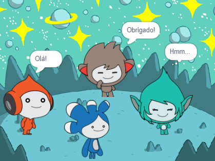

## Melhore o seu projeto

<div style="display: flex; flex-wrap: wrap">
<div style="flex-basis: 200px; flex-grow: 1; margin-right: 15px;">
Adicione o ator **Tera** e use qualquer um dos blocos que você aprendeu para fazer uma 'animação' para o ator **Tera**.
</div>
<div>

{:width="300px"}

</div>
</div>

You could also use the Text to Speech extension to make **Tera** speak out loud:

[[[scratch3-text-to-speech]]]

A personalidade do ato **Tera** é sua escolha, então divirta-se usando suas próprias idéias criativas.

```blocks3
when this sprite clicked

say [Hello!] for [2] seconds

say [Hello!]

say [] // hide speech bubble

think [Hmm...] for [2] seconds

switch costume to [tera-d v]

wait (1) seconds // 0.5 is half a second

set [color v] effect to [0] // number up to 200

clear graphic effects

play sound [pop v] until done

start sound [pop v]

speak [hello]
```

Você também pode brincar com o projeto e fazer quaisquer mudanças que você quiser. Você pode mudar o pano de fundo e como animar os atores, e até mesmo escolher diferentes atores e dar a eles emoções.

**Dica:** Clique no ator na lista de Atores abaixo do Palco para adicionar ou alterar o código, fantasia ou som.

--- collapse ---
---
title: Projeto concluído
---

Você pode ver o [projeto concluído aqui](https://scratch.mit.edu/projects/485673032/){:target="_blank"}.

--- /collapse ---

--- save ---
