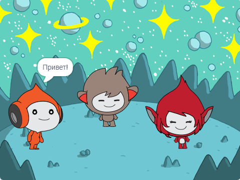

## What you will make

В этом проекте ты создашь космическую сцену с персонажами, которые «проявляют эмоции», чтобы поделиться своими мыслями или чувствами.

В Scratch персонажи и объекты называются **спрайтами** и они появляются на **Сцене**.

Ты будешь:
+ Добавлять спрайты и **фон**, чтобы создать свой проект
+ Нажимать на спрайты, чтобы они общались с помощью блоков кода `Внешний вид`{:class="block3looks"} и `Звук`{:class="block3sound"}
+ Использовать **Редактор изображений**, чтобы изменить **костюм**

--- no-print --- --- task ---
### Play ▶️

  
Нажми на каждый спрайт, чтобы увидеть, что они делают. 

Что произойдёт, если ты нажмёшь на один спрайт, а затем быстро нажмёшь на другой спрайт?

  <iframe allowtransparency="true" width="485" height="402" src="https://scratch.mit.edu/projects/embed/485673032/?autostart=false" frameborder="0"></iframe>

--- /task --- --- /no-print ---

--- print-only ---

--- /print-only ---

