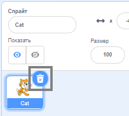

## Создай свою сцену

На этом этапе ты создашь свой проект с космическим фоном и первым спрайтом. 

{:width="300px"}

--- task ---

Открой [Стартовый проект Космический разговор](https://scratch.mit.edu/projects/582213331/editor){:target="_blank"}. Scratch откроется в другой вкладке браузера.

[[[working-offline]]]

--- /task ---

Редактор Scratch выглядит так:

**Сцена** - это то место, где выполняется твой проект. **Фон** изменяет внешний вид Сцены.

--- task ---

Щёлкни (или нажми на планшете) на **Выбрать фон** на панели Сцены:

--- /task ---

--- task ---

Щёлкни на категорию **Космос** или введи `космос` в поле поиска:

--- /task ---

В нашем примере мы выбрали **Космос**, но выбери тот фон, который тебе нравится больше всего.

--- task ---

Щелкни на выбранный фон, чтобы добавить его в свой проект. Сцена должна показать выбранный тобою фон:

--- /task ---

Ты видишь спрайт, который уже включён в твой проект? Это Кот Scratch.

--- task ---

Удали **Спрайт 1** (Кота Scratch): выбери спрайт **Спрайт 1** в списке Спрайтов под Сценой и щёлкни значок **Удалить**.

--- /task ---

--- task ---

Нажми **Выбрать спрайт** в Списке Спрайтов:

--- /task ---

--- task ---

Выбери категорию **Фантастика**. Щёлкни на спрайт **Pico**, чтобы добавить его в свой проект.

--- /task ---

--- task ---

Перетащи спрайт **Pico**, чтобы расположить его в левой части Сцены. Твоя Сцена должна выглядеть примерно так:

--- /task ---

--- task ---

Если ты вошёл в свою учетную запись Scratch, нажми на зелёную кнопку Ремикс. Это сохранит копию проекта в твоей учётной записи Scratch.

Введи название своего проекта в поле имени проекта в верхней части экрана.

**Совет:** Придумывай своим проектам понятные названия, чтобы ты мог легко их найти, когда у тебя будет много проектов.

Затем нажми на **Файл**, а затем **Сохранить сейчас**, чтобы сохранить проект.

Если ты сейчас не в сети интернет или у тебя нет учётной записи Scratch, ты можешь нажать **Сохранить на свой компьютер**, чтобы сохранить копию своего проекта.

--- /task ---

