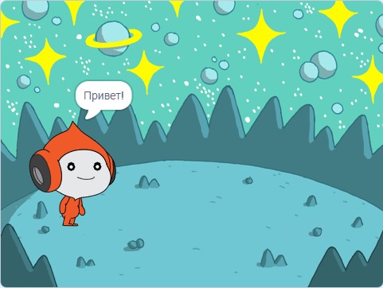
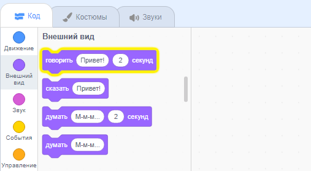
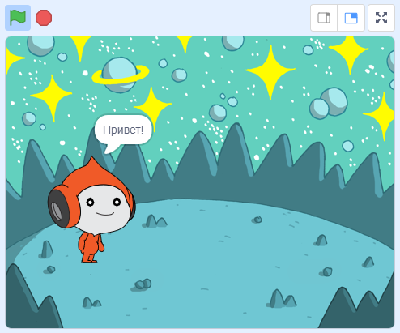
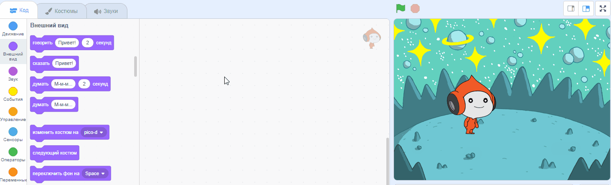
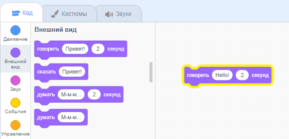
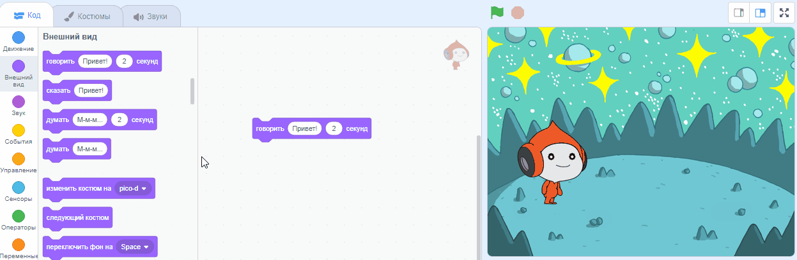
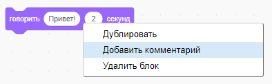

## Pico здоровается

<div style="display: flex; flex-wrap: wrap">
<div style="flex-basis: 200px; flex-grow: 1; margin-right: 15px;">
Спрайт может иметь код, костюмы и звуки, которые изменяют его внешний вид и действия. 
  
Ты добавишь блоки кода, чтобы Pico выражал эмоцию словами и звуком при нажатии на спрайт.
</div>
<div>

{:width="300px"}

</div>
</div>

<p style="border-left: solid; border-width:10px; border-color: #0faeb0; background-color: aliceblue; padding: 10px;">
<span style="color: #0faeb0">**Emotes**</span> are a way of showing the personality of a character in a game. They can use speech, sounds, movement, and graphic effects, just like in Scratch. Do you play any games that use emotes?
</p>

### Use the say block

--- task ---

Открой меню блоков `Внешний вид`{:class="block3looks"}.

Нажми блок `говорить`{:class="block3looks"} `Привет!` `2` `секунд`{:class="block3looks"}.



**Pico** покажет диалоговое окно в течение двух секунд.



**Совет:** Блоки кода в Scratch светятся жёлтым контуром, когда они работают.

--- /task ---

--- task ---

Перетащи блок `говорить`{:class="block3looks"} `Привет!` `2` `секунд`{:class="block3looks"} в Область кода. Щёлкни по нему ещё раз.





--- /task ---

### Make Pico talk when clicked (or tapped)

--- task ---

Перетащи блок `когда спрайт нажат`{:class="block3events"} из меню блоков `События`{:class="block3events"} и соедини его к верхней части твоего блока `говорить`{:class="block3looks"} в Области кода. Блоки соединятся.




```blocks3
+when this sprite clicked
say [Hello!] for [2] seconds // hide speech after 2 seconds
```

--- /task ---

### Code comments

```blocks3
say [Hello!] for [2] seconds // hide speech after 2 seconds
```
Ты увидишь комментарии в примерах кода. Тебе не нужно добавлять комментарии при добавлении кода в свой проект.

Если у тебя есть время, когда ты закончил свой проект, рекомендуется добавить комментарии к своему коду, чтобы его было легче понять позже. Чтобы добавить комментарий, щелкни правой кнопкой мыши (или на планшете нажми и удерживай) блок в Области кода и выбери **Добавить комментарий**.



### Test

--- task ---

**Тест:** Нажми на **Pico** на Сцене и убедись, что диалоговое окно появляется на две секунды. Важно протестировать свой код, чтобы убедиться, что он делает то, что ты ожидаешь.

--- /task ---

--- task ---

You have already saved your project and given it a name. Scratch will now **automatically** save for you.

You can still click save if you like, just to make sure.

--- /task ---
