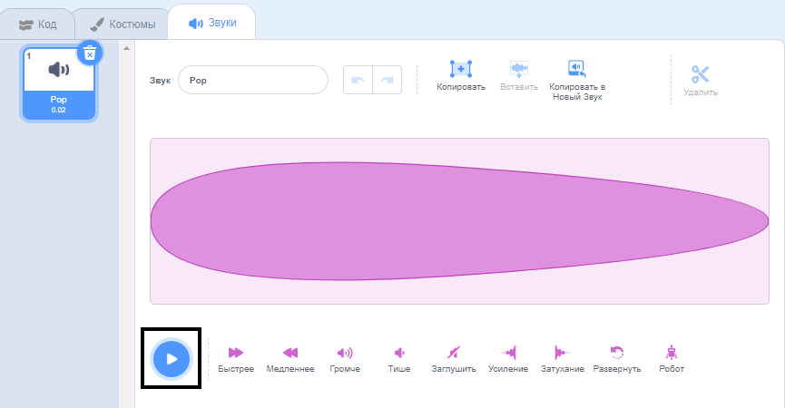
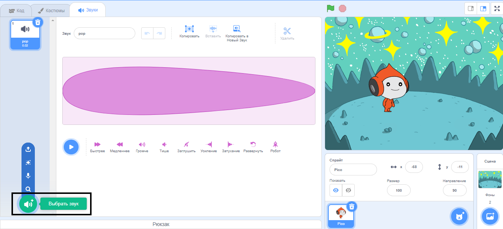
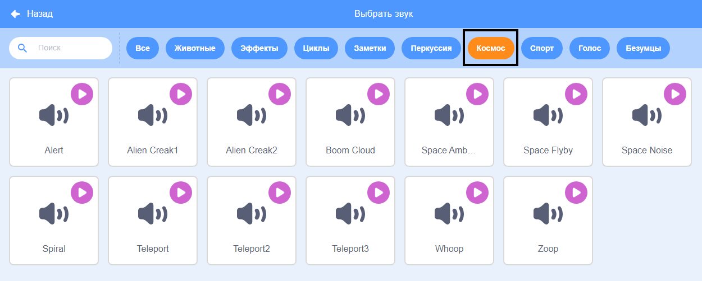
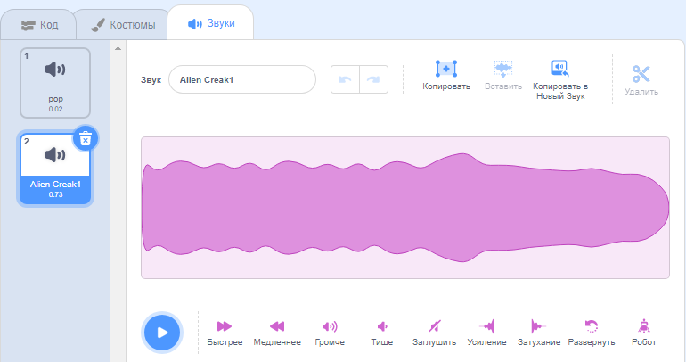
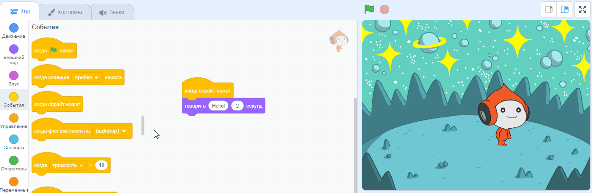
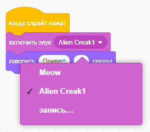

## Pico воспроизводит звук

<div style="display: flex; flex-wrap: wrap">
<div style="flex-basis: 200px; flex-grow: 1; margin-right: 15px;">
Другой способ общения - использование звука.
</div>
<div>

{:width="300px"}

</div>
</div>

### Add a sound to the Pico Sprite

--- task ---

Щелкни вкладку **Звуки** для спрайта **Pico** и ты найдешь звук **pop**. Щёлкни значок **Играть**, чтобы услышать звук **pop**.



Также проверь, работает ли звук на твоём компьютере или планшете.

--- /task ---

--- task ---

Чтобы выбрать новый звук, щёлкни значок **Выбрать звук** и выбери категорию **Космос** или введи `космос` в поле поиска.






--- /task ---

--- task ---

Воспроизведи несколько разных звуков с помощью значков **Играть**. Как только ты найдёшь звук, который хочешь использовать, щёлкни по нему, чтобы добавить в свой проект.



--- /task ---

### Make the sound play when clicked (or tapped)

--- task ---

Перейди на вкладку **Код**. В меню блоков `Звук`{:class="block3sound"} найди блок `включить звук`{:class="block3sound"}.

Перетащи блок в Область кода между блоком `когда спрайт нажат`{:class="block3events"} и блоком `говорить`{:class="block3looks"}. Откроется щель, и блок встанет на место.



Твой код должен выглядеть вот так:


```blocks3
when this sprite clicked
+start sound [Alien Creak1 v] 
say [Hello!] for [2] seconds // hide speech after 2 seconds
```

--- /task ---

### Test your code

--- task ---

Убедись, что в блоке `включить звук`{:class="block3sound"} есть выбранный тобой звук. Если это не так, тебе нужно нажать на звук в блоке `включить звук`{:class="block3sound"}, а затем выбрать выбранный звук в раскрывающемся меню.



--- /task ---

--- task ---

Щелкни вкладку **Звуки** для спрайта **Pico** и ты найдешь звук **pop**. Щёлкни значок **Играть**, чтобы услышать звук **pop**.

--- /task ---

