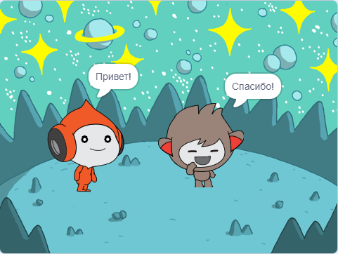
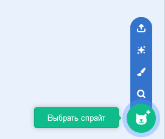
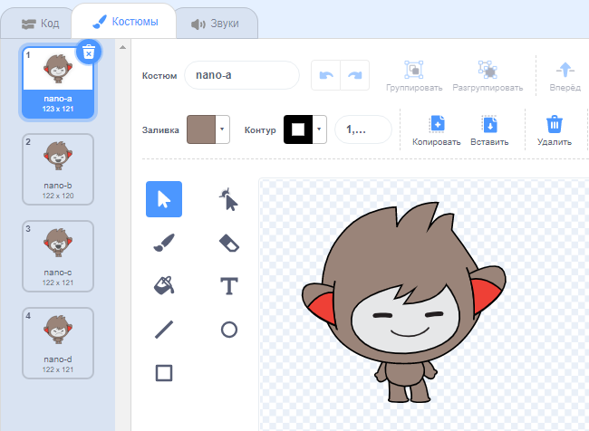
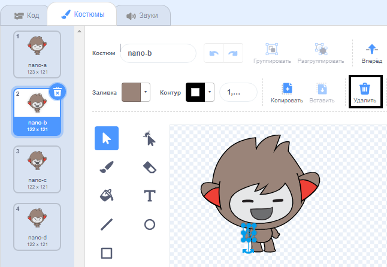
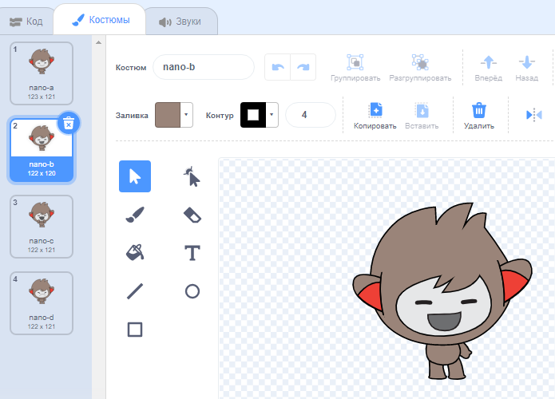
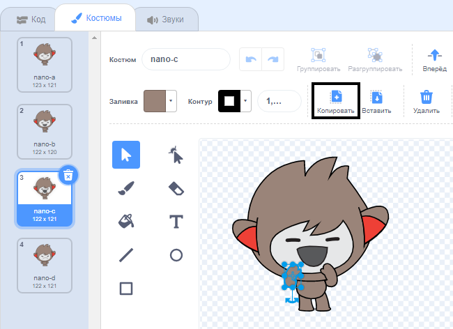
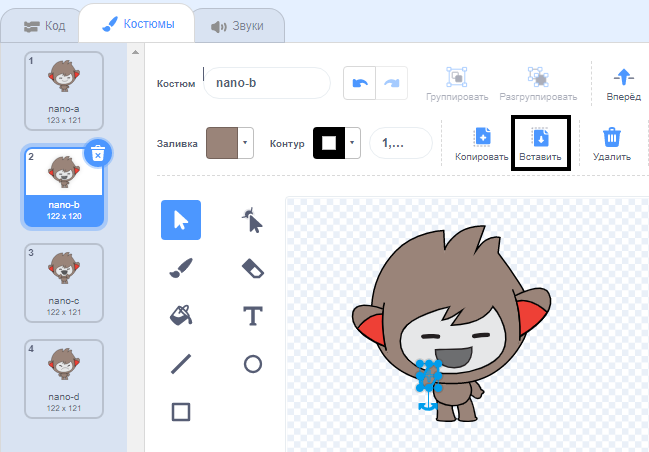

## Nano меняет костюмы

<div style="display: flex; flex-wrap: wrap">
<div style="flex-basis: 200px; flex-grow: 1; margin-right: 15px;">

У тебя получится, чтобы Nano проявил эмоцию, сменив **костюмы**.

У спрайтов есть **костюмы**, чтобы изменить их внешний вид. They are usually slightly different images of the same sprite. Чтобы оживить спрайт, ты можешь изменить его костюмы.

</div>
<div>

{:width="300px"}

</div>
</div>

### Nano говорит: «Спасибо!»

--- task ---

Добавь в свой проект спрайт **Nano** из категории **Фантастика**.



--- /task ---

--- task ---

Убедись, что **Nano** выбран в Списке Спрайтов под Сценой.


Click on the **Code** tab and add a script to get the **Nano** sprite to sign 'Thanks' using `switch costume to`{:class="block3looks"} and `wait`{:class="block3control"}. Use the drop down menu to switch between `nano-b`{:class="block3looks"} and `nano-a`{:class="block3looks"}:


```blocks3
when this sprite clicked // when Nano is clicked
switch costume to [nano-b v] // Nano talking
wait (0.5) seconds // try 0.25 instead of 0.5
switch costume to [nano-a v] // Nano smiling
```
--- /task ---

**Совет:** Все блоки имеют цветовую кодировку, поэтому ты найдёшь блок `изменить костюм на`{:class="block3looks"} в меню блоков `Внешний вид`.

--- task ---

**Тест:** Нажми на спрайт **Nano** на Сцене и убедись, что диалоговое окно появляется и костюм Nano изменяется.

--- /task ---

### Nano использует язык жестов

<p style="border-left: solid; border-width:10px; border-color: #0faeb0; background-color: aliceblue; padding: 10px;">Миллионы людей используют язык жестов для общения. A common way to sign 'Thank you' is to place your fingers on your chin with your hand as flat as possible. You then move your hand forwards, away from your chin and slightly down. 
</p>

<!-- Add a video of someone signing -->

Nano будет использовать язык жестов, меняя костюмы.

Ты можешь редактировать костюмы для своих спрайтов с помощью графического редактора. Ты отредактируешь костюм Nano, чтобы он сделал знак «спасибо».

--- task ---

Перейди на вкладку **Костюмы**, чтобы увидеть костюмы для спрайта **Nano**:



--- /task ---

--- task ---

Нажми на костюм **nano-b**. Нажми на руку с левой стороны, а затем нажми на **Удалить**.



Костюм должен выглядеть так:



--- /task ---

**Совет:** Если ты ошибся в графическом редакторе, ты можешь нажать на **Отменить**.


--- task ---

Перейди на костюм **nano-c** и нажми на руку с левой стороны, затем нажми **Копировать**.



--- /task ---

--- task ---

Вернись к костюму **nano-b** и нажми на **Вставить**. Костюм должен выглядеть так:



--- /task ---

--- task ---

**Тест:** Нажми на спрайт **Nano** на Сцене и убедись, что появляется диалоговое окно и костюм Nano меняется на костюм, который ты редактировал.

--- /task ---

<p style="border-left: solid; border-width:10px; border-color: #0faeb0; background-color: aliceblue; padding: 10px;">Ты научился как показывать знак «спасибо». В следующий раз, когда ты будешь кого-нибудь благодарить, почему бы не использовать свой новый навык?
</p>

