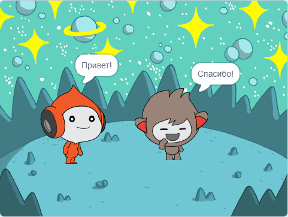
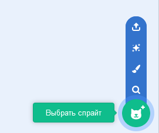
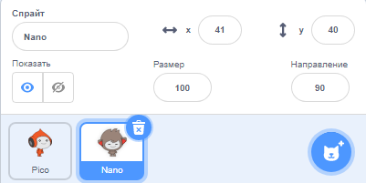
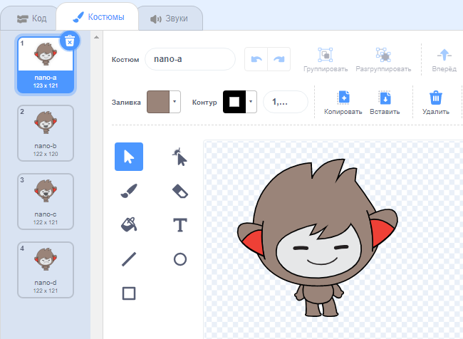
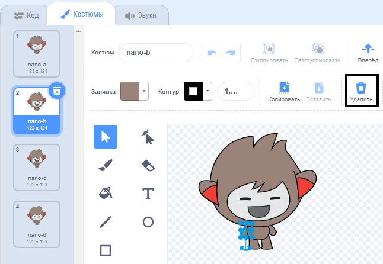
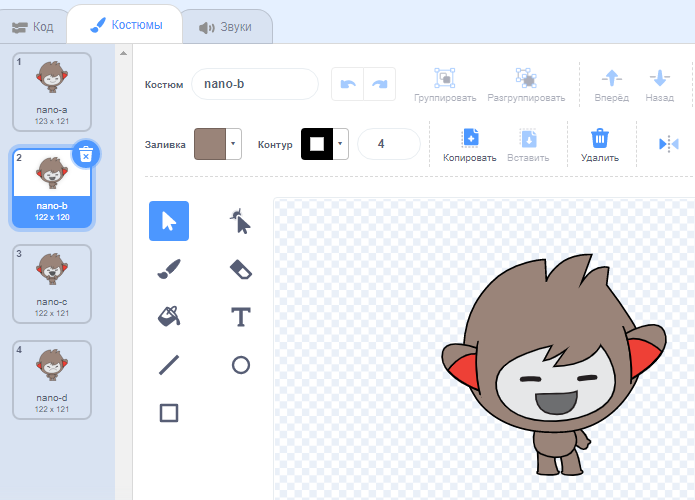
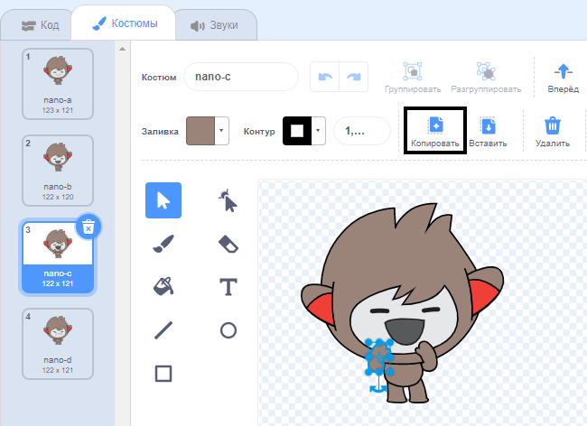
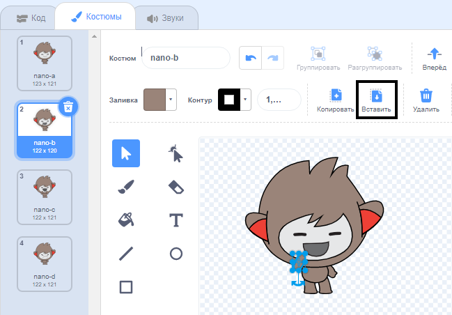

## Nano меняет костюмы

<div style="display: flex; flex-wrap: wrap">
<div style="flex-basis: 200px; flex-grow: 1; margin-right: 15px;">

У тебя получится, чтобы Nano проявил эмоцию, сменив **костюмы**.

У спрайтов есть **костюмы**, чтобы изменить их внешний вид. Чтобы оживить спрайт, ты можешь изменить его костюмы.

</div>
<div>

{:width="300px"}

</div>
</div>

### Nano говорит: «Спасибо!»

> [!TASK]
>
> Добавь в свой проект спрайт **Nano** из категории **Фантастика**.
>
> 

> [!TASK]
>
> Убедись, что **Nano** выбран в Списке Спрайтов под Сценой.
>
> 
>
> Перейди на вкладку **Код** и добавь скрипт, чтобы спрайт **Nano** мог `говорить`{:class="block3looks"} `Спасибо!`:
>
> 
>
> ```blocks3
> when this sprite clicked // при нажатии на Nano
> switch costume to [nano-b v] // Nano разговаривает
> say [Спасибо!] for [2] seconds // попробуй 1 вместо 2
> switch costume to [nano-a v] // Nano улыбается
> ```

**Совет:** Все блоки имеют цветовую кодировку, поэтому ты найдёшь блок `изменить костюм на`{:class="block3looks"} в меню блоков `Внешний вид`.

> [!TASK]
>
> **Тест:** Нажми на спрайт **Nano** на Сцене и убедись, что диалоговое окно появляется и костюм Nano изменяется.

### Nano использует язык жестов

<p style="border-left: solid; border-width:10px; border-color: #0faeb0; background-color: aliceblue; padding: 10px;">Миллионы людей используют язык жестов для общения. Распространенный знак "спасибо" - это **поднести правую руку ко рту**. 
</p>

Nano будет использовать язык жестов, меняя костюмы.

Ты можешь редактировать костюмы для своих спрайтов с помощью графического редактора. Ты отредактируешь костюм Nano, чтобы он сделал знак «спасибо».

> [!TASK]
>
> Перейди на вкладку **Костюмы**, чтобы увидеть костюмы для спрайта **Nano**:
>
> 

> [!TASK]
>
> Нажми на костюм **nano-b**. Нажми на руку с левой стороны, а затем нажми на **Удалить**.
>
> 
>
> Костюм должен выглядеть так:
>
> 

**Совет:** Если ты ошибся в графическом редакторе, ты можешь нажать на **Отменить**.


> [!TASK]
>
> Перейди на костюм **nano-c** и нажми на руку с левой стороны, затем нажми **Копировать**.
>
> 

> [!TASK]
>
> Вернись к костюму **nano-b** и нажми на **Вставить**. Костюм должен выглядеть так:
>
> 

> [!TASK]
>
> **Тест:** Нажми на спрайт **Nano** на Сцене и убедись, что появляется диалоговое окно и костюм Nano меняется на костюм, который ты редактировал.

<p style="border-left: solid; border-width:10px; border-color: #0faeb0; background-color: aliceblue; padding: 10px;">Ты научился как показывать знак «спасибо». В следующий раз, когда ты будешь кого-нибудь благодарить, почему бы не использовать свой новый навык?
</p>

> [!SAVE]
