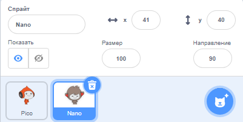

## Nano меняет костюмы

<div style="display: flex; flex-wrap: wrap">
<div style="flex-basis: 200px; flex-grow: 1; margin-right: 15px;">

У тебя получится, чтобы Nano проявил эмоцию, сменив **костюмы**.

У спрайтов есть **костюмы**, чтобы изменить их внешний вид. They are usually slightly different images of the same sprite. Чтобы оживить спрайт, ты можешь изменить его костюмы.

</div>
<div>

{:width="300px"}

</div>
</div>

--- task ---

Добавь в свой проект спрайт **Nano** из категории **Фантастика**.


--- /task ---

--- task ---

Убедись, что **Nano** выбран в Списке Спрайтов под Сценой.



Перейди на вкладку **Код** и добавь скрипт, чтобы спрайт **Nano** мог `говорить`{:class="block3looks"} `Спасибо!`: Use the drop down menu to switch between `nano-b`{:class="block3looks"} and `nano-a`{:class="block3looks"}:


```blocks3
when this sprite clicked // при нажатии на Nano
switch costume to [nano-b v] // Nano разговаривает
say [Спасибо!] for [2] seconds // попробуй 1 вместо 2
switch costume to [nano-a v] // Nano улыбается
```
--- /task ---

**Совет:** Все блоки имеют цветовую кодировку, поэтому ты найдёшь блок `изменить костюм на`{:class="block3looks"} в меню блоков `Внешний вид`.

--- task ---

**Тест:** Нажми на спрайт **Nano** на Сцене и убедись, что диалоговое окно появляется и костюм Nano изменяется.

--- /task ---
