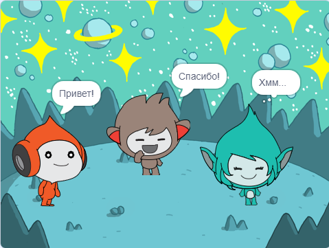

## Giga меняет цвет

<div style="display: flex; flex-wrap: wrap">
<div style="flex-basis: 200px; flex-grow: 1; margin-right: 15px;">
Спрайты также могут использовать выноски и менять цвета, чтобы показать свою индивидуальность. Ты сделаешь так, чтобы Giga сделал это.
</div>
<div>

{:width="300px"}

</div>
</div>

--- task ---

Добавь спрайт **Giga**.

Перетащи спрайт **Giga** в правую часть Сцены.

--- /task ---

--- task ---

Убедись, что у тебя спрайт **Giga** выбран в Списке Спрайтов под Сценой. Добавь этот код, чтобы спрайт **Giga** мог общаться, изменяя цвет:


```blocks3
when this sprite clicked
set [color v] effect to [0] // 0 - начальный цвет
think [Хммм...] for [2] seconds 
clear graphic effects // вернуться к исходному цвету
```

--- /task ---

**Совет:** Щёлкни спрайт в Списке Спрайтов под Сценой, прежде чем добавлять или изменять его код, костюмы или звук. Убедись, что ты выбрал нужный спрайт.

--- task ---

Попробуй использовать разные числа от `1` до `200` в `установить эффект цвет`{:class="block3looks"}, пока не найдёшь цвет, который тебе понравится.

--- /task ---

--- task ---

Измени слова и количество секунд в блоке `думать`{:class="block3looks"}.

--- /task ---

--- task ---

**Тест:** Нажми на спрайт **Giga** на Сцене и убедись, что спрайт меняет цвет и показывает о чём он думает.

--- /task ---

--- save ---
