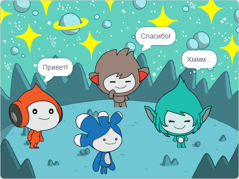

## Улучшение своего проекта

<div style="display: flex; flex-wrap: wrap">
<div style="flex-basis: 200px; flex-grow: 1; margin-right: 15px;">
Добавь спрайт **Tera** и используй любой из блоков, о которых ты узнал, чтобы создать «эмоцию» для спрайта **Tera**.
</div>
<div>

{:width="300px"}

</div>
</div>

You could also use the Text to Speech extension to make **Tera** speak out loud:

[[[scratch3-text-to-speech]]]

Личные качества спрайта **Tera** - это твой выбор, так что получай удовольствие, используя свои собственные творческие идеи.

```blocks3
when this sprite clicked

say [Hello!] for [2] seconds

say [Hello!]

say [] // hide speech bubble

think [Hmm...] for [2] seconds

switch costume to [tera-d v]

wait (1) seconds // 0.5 is half a second

set [color v] effect to [0] // number up to 200

clear graphic effects

play sound [pop v] until done

start sound [pop v]

speak [hello]
```

Ты также можешь «переделать» проект, чтобы внести любые изменения, которые тебе нравятся. Ты можешь изменить фон и то, как спрайты проявляют эмоции, и даже выбрать разные спрайты и дать им эмоции.

**Совет:** Щёлкни спрайт в Списке Спрайтов под Сценой, чтобы изменить код, костюмы и звук для этого спрайта.

--- collapse ---
---
title: Завершённый проект
---

Ты можешь увидеть [завершённый проект здесь](https://scratch.mit.edu/projects/599532263/){:target="_blank"}.

--- /collapse ---

--- save ---
