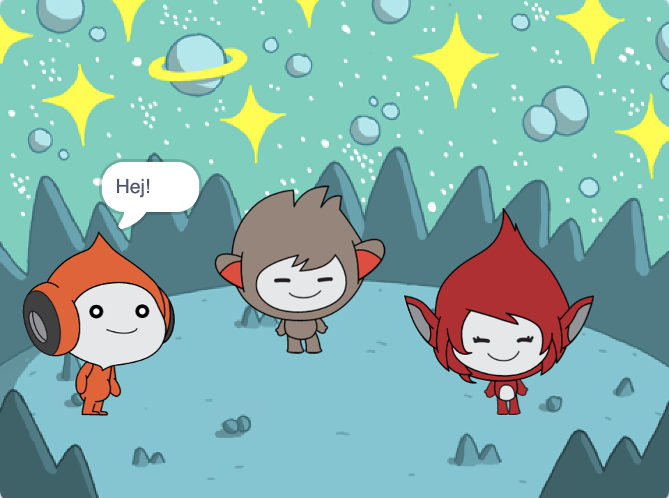

## Du kommer att skapa

Skapa en rymdbakgrund med karaktärer 👾 som gör gester för att dela sina tankar och känslor.

I Scratch kallas karaktärer och objekt **Sprajter** och visas på **Scenen**.

Du kommer:

- Lägg till sprajter och en **bakgrund** för att starta ditt projekt
- Klicka på sprajts för att få dem att kommunicera med `Utseende`{:class="block3looks"} och `:ljud`{:class="block3sound"} kodblock
- Använd **Färgredigeraren** för att ändra **klädsel**

> [!NOPRINT]
>
> > [!TASK]
> >
> > ### Spela ▶️
> >
> > 

> > 
  
> > Klicka på varje sprajt för att se vad de gör.
> >
> > Vad händer om du klickar på en sprajt och sedan snabbt klickar på en annan sprajt?
> >
> > 

> > 

> >   <iframe allowtransparency="true" width="485" height="402" src="https://scratch.mit.edu/projects/embed/827154361/?autostart=false" frameborder="0"></iframe>
> > 

> > 

> [!PRINTONLY]
>
> 

