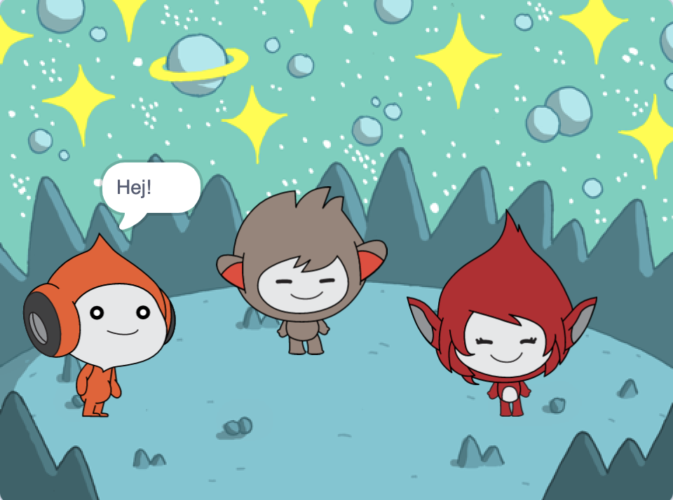

## What you will make

Skapa en rymdbakgrund med karaktärer 👾 som gör gester för att dela sina tankar och känslor.

I Scratch kallas karaktärer och objekt **Sprajter** och visas på **Scenen**.

Du kommer:
+ Lägg till sprajter och en **bakgrund** för att starta ditt projekt
+ Klicka på sprajts för att få dem att kommunicera med `Utseende`{:class="block3looks"} och `:ljud`{:class="block3sound"} kodblock
+ Använd **Färgredigeraren** för att ändra **klädsel**

--- no-print --- --- task ---
### Spela ▶️

  
Klicka på varje sprajt för att se vad de gör. 

Vad händer om du klickar på en sprajt och sedan snabbt klickar på en annan sprajt?

  <iframe allowtransparency="true" width="485" height="402" src="https://scratch.mit.edu/projects/embed/485673032/?autostart=false" frameborder="0"></iframe>

--- /task --- --- /no-print ---

--- print-only ---

--- /print-only ---

