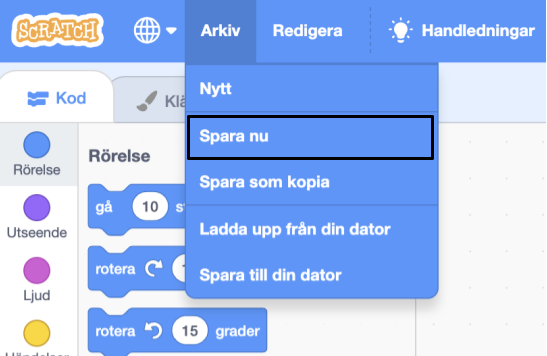

## Skapa din scen

Påbörja ditt projekt med en rymdbakgrund och den första sprajten. 

{:width="300px"}

### Öppna startprojektet

--- task ---

Öppna [Rymdsamtal startprojektet](https://scratch.mit.edu/projects/582213331/editor){:target="_blank"}. Scratch kommer öppnas i en annan flik i webbläsaren.

[[[working-offline]]]

--- /task ---

### Scratch-redigeraren

### Lägg till en bakgrund

**Scenen** är där ditt projekt körs. En **bakgrund** förändrar scenens utseende.

--- task ---

Klicka (eller tryck på en surfplatta) på **Välj en bakgrund** i scenfönstret:

--- /task ---

--- task ---

Klicka på kategorin **Rymden** eller skriv `space` i sökrutan:

--- /task ---

I vårt exempel har vi valt bakgrunden **Space**, men välj den bakgrund som du gillar mest.

--- task ---

Klicka på din valda bakgrund för att lägga till den till ditt projekt. Scenen ska visa bakgrunden som du valde:

--- /task ---

### Lägg till en sprajt

Kan du see sprajten som redan finns i ditt projekt? Det är Scratch-katten.

--- task ---

Ta bort sprajten **Sprajt1** (Scratch Cat): välj sprajten **Sprajt1** i Sprajt-listan under scenen och klicka på ikonen **Ta bort**.

--- /task ---

--- task ---

Klicka på **Välj en Sprajt** i Sprajt-listan:

--- /task ---

--- task ---

Välj kategorin **Fantasy**. Klicka på **Pico**-sprajten för att lägga till den i ditt projekt.

--- /task ---

--- task ---

Dra i **Pico**-sprajten för att placera den på den vänstra sidan av scenen. Din scen bör se ut ungefär så här:

--- /task ---

--- task ---

**Spara**: Om du är inloggad på ditt Scratch-konto, klicka på den gröna Remix-knappen. Detta kommer spara en kopia av projektet till ditt Scratch-konto.

Skriv namnet på ditt projekt i projektnamnsrutan högst upp på skärmen.

**Tips:** Ge dina projekt tydliga namn så att du enkelt kan hitta dem när du har många projekt.

Klicka sedan på **Fil**och på **Spara nu** för att spara ditt projekt.

Om du inte är online eller inte har ett Scratch-konto kan du klicka på **Spara till din dator** för att spara en kopia av ditt projekt.

--- /task ---

