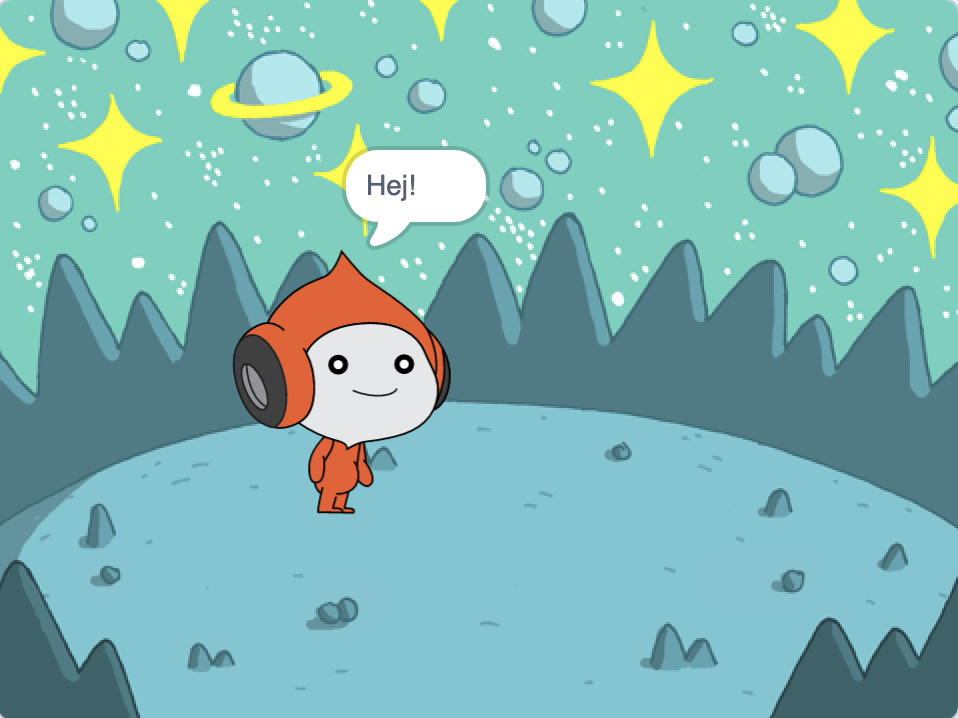
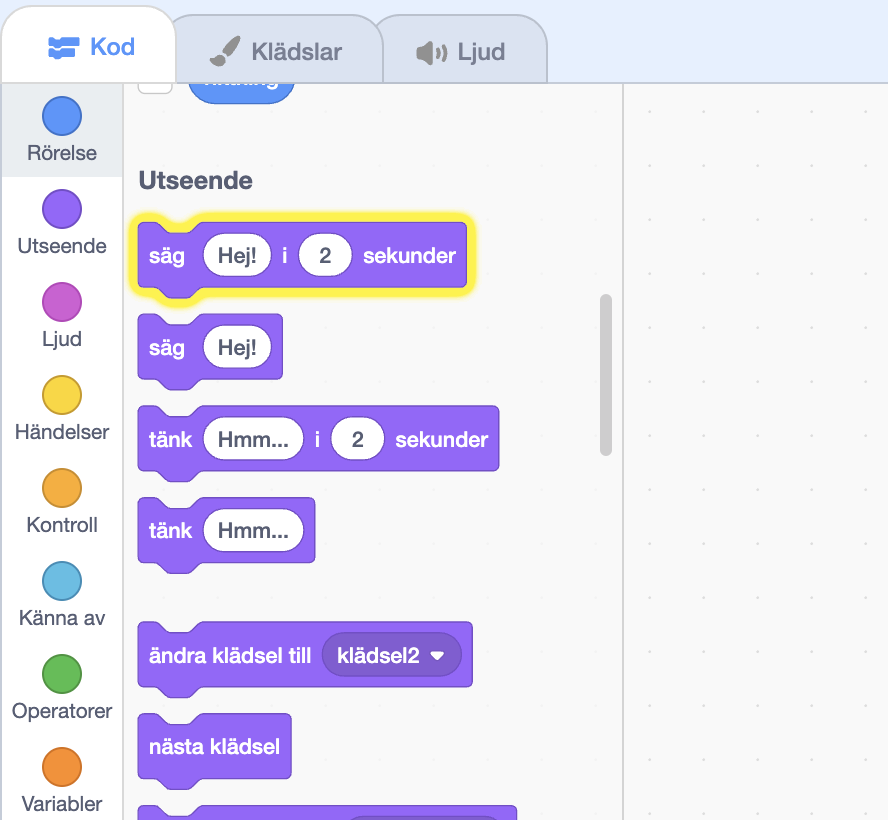
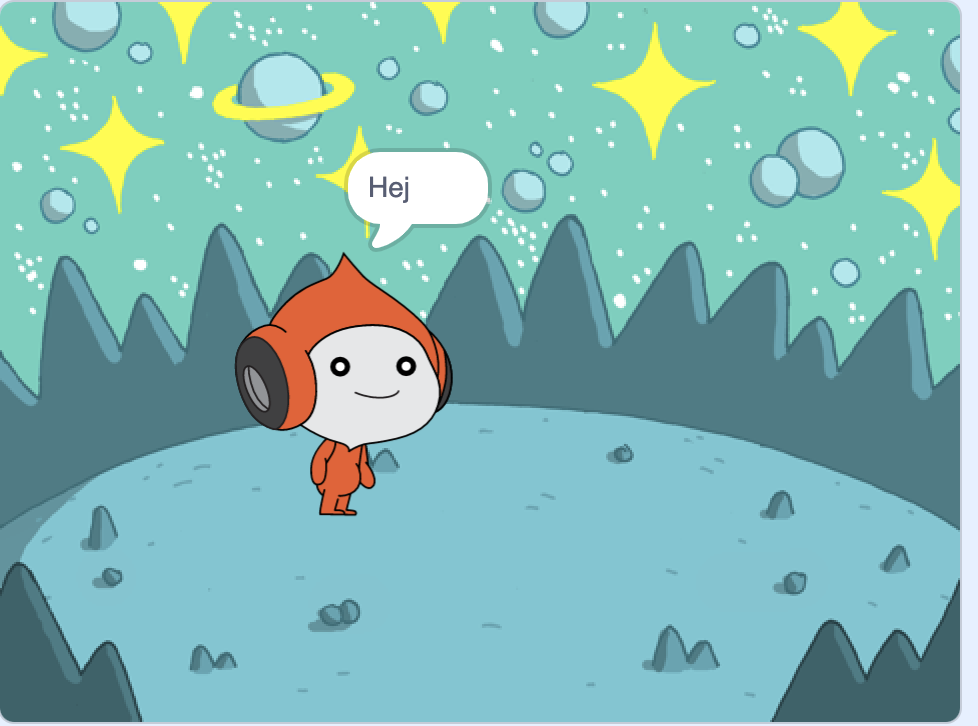
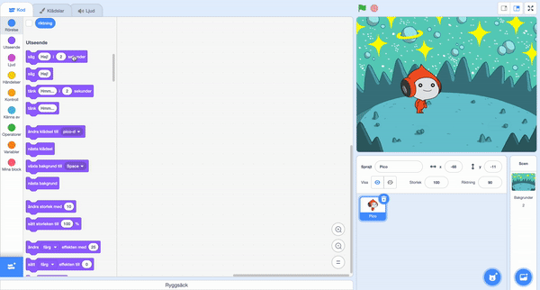
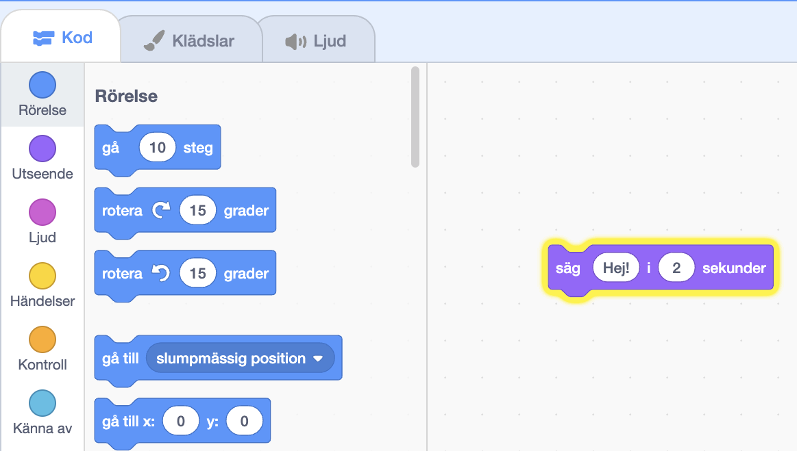
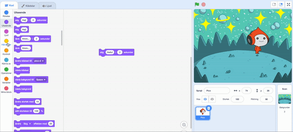
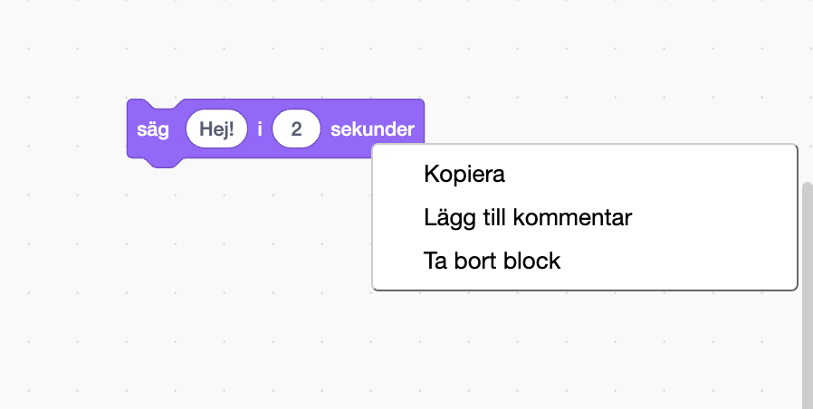

## Pico säger hej

<div style="display: flex; flex-wrap: wrap">
<div style="flex-basis: 200px; flex-grow: 1; margin-right: 15px;">
En sprajt kan ha kod, klädsel och ljud som förändrar hur den ser ut och vad den gör. 
  
Lägg till kodblock för att få Pico att göra en gest med ord och ljud när sprajten klickas.
</div>
<div>

{:width="300px"}

</div>
</div>

<p style="border-left: solid; border-width:10px; border-color: #0faeb0; background-color: aliceblue; padding: 10px;">
<span style="color: #0faeb0">**Gester**</span> kan visa karaktärers personlighet i spel. De kan använda tal, ljud, rörelser och visuella effekter, precis som i Scratch. Spelar du några spel som använder gester?
</p>

### Använd sägblocket

--- task ---

Öppna menyn `Utseende`{:class="block3looks"}block.

Klicka på ett `säg`{:class="block3looks"} `Hej!` `i`{:class="block3looks"} `2` `sekunder`{:class="block3looks"}block.



**Pico** -sprajten visar en pratbubbla i två sekunder.



**Tips:** Kodblock i Scratch lyser med en gul kontur när de är igång.

--- /task ---

--- task ---

Dra `säg`{:class="block3looks"} `Hej!` `i`{:class="block3looks"} `2` `sekunder`{:class="block3looks"}blocket till kodområdet. Klicka på den igen.





--- /task ---

### Få Pico att prata när du klickar (eller trycker)

--- task ---

Dra ett `när denna sprajt klickas på`{:class="block3events"}block från menyn `Händelser`{:class="block3events"}block och sätt den ovanpå `säg`{:class="block3looks"}blocket i kodområdet. Blocken kommer sättas ihop.




```blocks3
+when this sprite clicked
say [Hej!] for [2] seconds // dölj tal efter 2 sekunder
```

--- /task ---

### Kodkommentarer

```blocks3
say [Hej!] for [2] seconds // dölj tal efter 2 sekunder
```
Du kommer se kommentarer i kodexemplen. Du behöver inte lägga till kommentarerna när du lägger till kod till ditt projekt.

Om du har tid när du är klar med ditt projekt, är det en bra idé att lägga till kommentarer till din kod så att det blir lättare att förstå senare. Högerklicka (eller tryck och håll kvar på surfplatta) på ett block i kodområdet och välj **Lägg till kommentar** för att kommentera.



### Test

--- task ---

**Test:** Klicka på **Pico**-sprajten på scenen och kontrollera att pratbubblan syns i två sekunder. Det är viktigt att testa din kod för att kolla att den gör vad du förväntar dig.

--- /task ---

--- task ---

Du har redan sparat ditt projekt och gett det ett namn. Scratch kommer nu **automatiskt** spara åt dig.

Du kan fortfarande klicka på spara om du vill, bara för att vara säker.

--- /task ---
