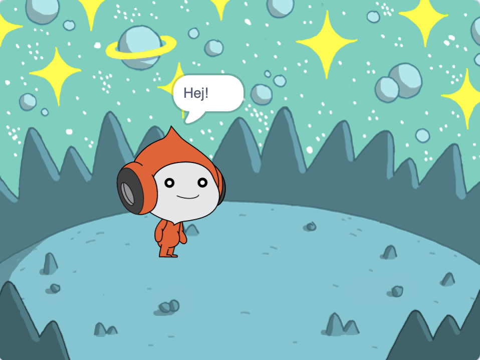
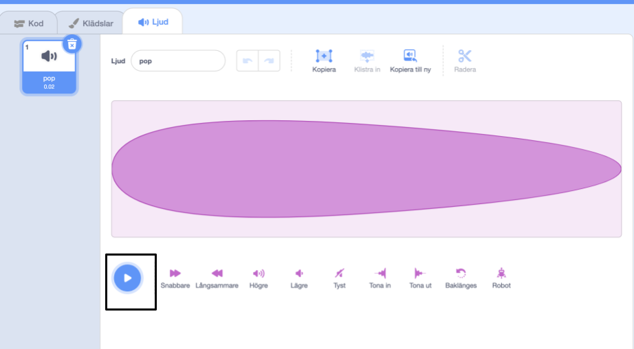
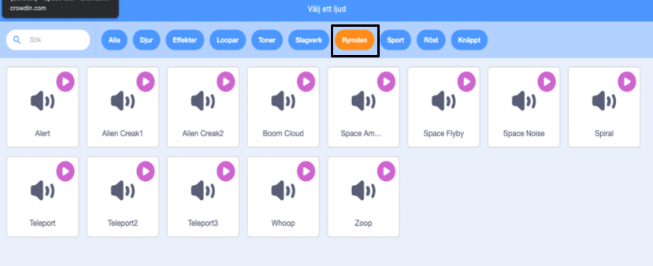

## Pico spelar ett ljud

<div style="display: flex; flex-wrap: wrap">
<div style="flex-basis: 200px; flex-grow: 1; margin-right: 15px;">
Ett annat sätt att kommunicera är genom ljud.
</div>
<div>

{:width="300px"}

</div>
</div>

### Lägg till ett ljud till Pico-sprajten

--- task ---

Klicka på **Ljud**-fliken för **Pico**-sprajten så kommer du se ett **pop**-ljud. Klicka på **Spela**-ikonen för att höra **pop**-ljudet.



**Debug**: Om du inte hör något, kontrollera att ljudet fungerar på din dator eller surfplatta.

--- /task ---

--- task ---

För att välja ett nytt ljud, klicka på ikonen **Välj ett ljud** och välj kategorin **Rymden** eller skriv `space` i sökrutan.




--- /task ---

--- task ---

Spela några olika ljud med **Spela** -ikonerna. När du har hittat ett ljud som du tycker om, klicka på det för att lägga till det till ditt projekt.


--- /task ---

### Få ljudet att spela när du klickar (eller trycker) på den

--- task ---

Klicka på **Kod**fliken. I `Ljud`{:class="block3sound"}blockmenyn, hitta blocket `startljud`{:class="block3sound"}.

Dra blocket till kodområdet och sätt det mellan `när denna sprajt klickas`{:class="block3events"}blocket och `säg`{:class="block3looks"}blocket. En mellanrum kommer öppnas och blocket kommer sättas på plats.


Din kod ska se ut så här:


```blocks3
when this sprite clicked
+start sound [Alien Creak1 v] 
say [Hello!] for [2] seconds // hide speech after 2 seconds
```

--- /task ---

### Testa din kod

--- task ---

Kontrollera att ditt `starta ljud`{:class="block3sound"}block har ditt valda ljud. Om det inte gör det måste du klicka på ljudet i `starta ljud`blocket {:class="block3sound"} och välja ditt ljud i menyn.


--- /task ---

--- task ---

**Test:** Klicka på **Pico**sprajten och kolla att pratbubblan dyker upp och att du kan höra ljudet. Om du inte hör ljudet, se till att du har lagt till `starta ljud`{:class="block3sound"}-blocket under `:när denna sprajt klickas på`{:class="block3events"}-blocket.

--- /task ---

