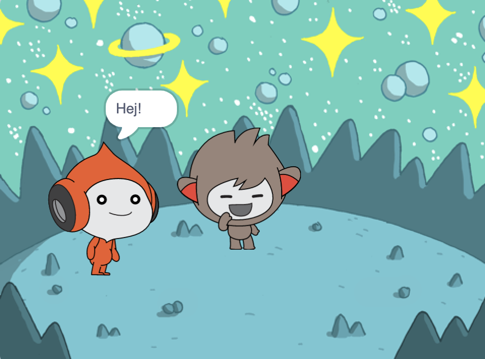
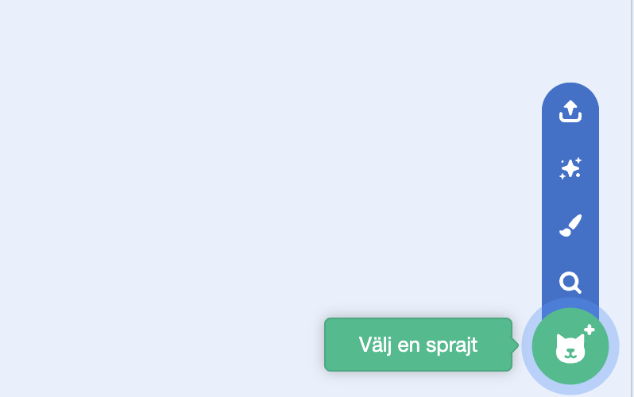
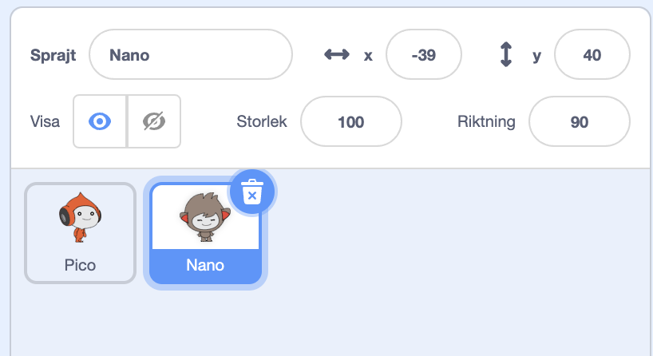

## Nano byter klädsel

<div style="display: flex; flex-wrap: wrap">
<div style="flex-basis: 200px; flex-grow: 1; margin-right: 15px;">

Få Nano att gestikulera genom att byta **klädsel**.

Sprajter har **klädslar** för att förändra deras utseenende. They are usually slightly different images of the same sprite. För att animera en sprajt kan du ändra dess klädsel.

</div>
<div>

{:width="300px"}

</div>
</div>

--- task ---

Lägg till **Nano**sprajten till ditt projekt från kategorin **Fantasy**.



--- /task ---

--- task ---

Se till att **Nano**-sprajten är vald i sprajtlistan under scenen.



Click on the **Code** tab and add a script to get the **Nano** sprite to change costume using `switch costume to`{:class="block3looks"} and `wait`{:class="block3control"}. Use the drop down menu to switch between `nano-b`{:class="block3looks"} and `nano-a`{:class="block3looks"}:


```blocks3
when this sprite clicked // när Nano blir klickad
switch costume to [nano-b v] // Nano pratar
wait (0.5) seconds // prova 0,25 istället för 0,5
switch costume to [nano-a v] // Nano ler
```
--- /task ---

**Tips:** Alla blocken är färgkodade, så du hittar `ändra klädsel till`{:class="block3looks"}blocket i menyn `Utseende`{:class="block3looks"}block och `vänta`{:class="block3control"}blocket i `Kontroll`{:class="block3control"}blockmenyn.

--- task ---

**Test:** Klicka på **Nano**sprajten på scenen och kontrollera att Nanos klädsel ändras.

--- /task ---
