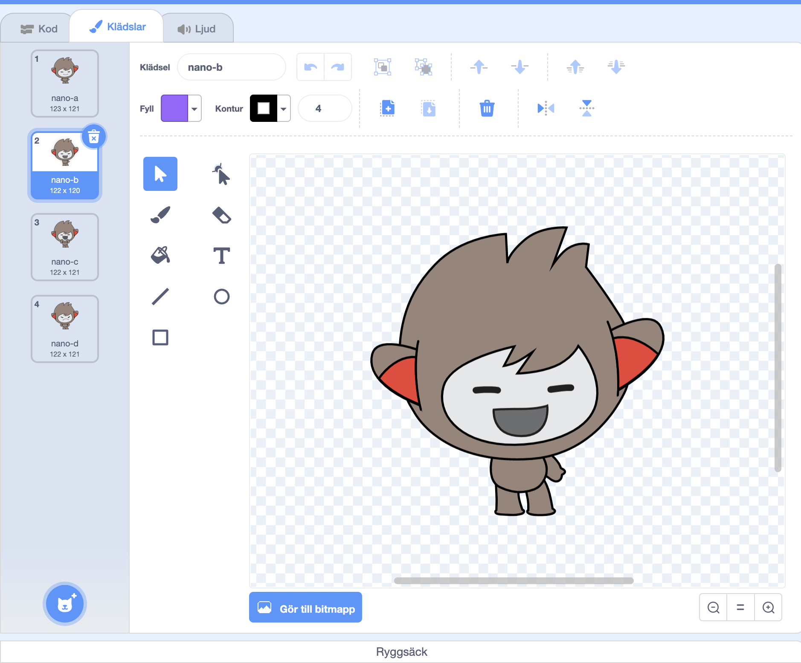

## Nano byter klädsel

<div style="display: flex; flex-wrap: wrap">
<div style="flex-basis: 200px; flex-grow: 1; margin-right: 15px;">

Få Nano att gestikulera genom att byta **klädsel**.

Sprajter har **klädslar** för att förändra deras utseenende. För att animera en sprajt kan du ändra dess klädsel.

</div>
<div>

{:width="300px"}

</div>
</div>

### Nano tecknar "Tack!"

--- task ---

Lägg till **Nano**sprajten till ditt projekt från kategorin **Fantasy**.


--- /task ---

--- task ---

Se till att **Nano**-sprajten är vald i sprajtlistan under scenen.


Klicka på **Kod**fliken och lägg till ett skript för att få **Nano**sprajten att teckna "Tack" med `ändra klädsel till`{:class="block3looks"} och `vänta`{:class="block3control"}:


```blocks3
when this sprite clicked // när Nano blir klickad
switch costume to [nano-b v] // Nano pratar
wait (0.5) seconds // prova 0,25 istället för 0,5
switch costume to [nano-a v] // Nano ler
```
--- /task ---

**Tips:** Alla blocken är färgkodade, så du hittar `ändra klädsel till`{:class="block3looks"}blocket i menyn `Utseende`{:class="block3looks"}block och `vänta`{:class="block3control"}blocket i `Kontroll`{:class="block3control"}blockmenyn.

--- task ---

**Test:** Klicka på **Nano**sprajten på scenen och kontrollera att Nanos klädsel ändras.

--- /task ---

### Nano använder teckenspråk

<p style="border-left: solid; border-width:10px; border-color: #0faeb0; background-color: aliceblue; padding: 10px;">Miljontals människor använder teckenspråk för att kommunicera. Ett vanligt sätt att teckna "Tack" är att placera fingrarna på hakan med handen så platt som möjligt. Du flyttar sedan handen framåt, bort från hakan och något nedåt. 
</p>

<!--- Add a video of someone signing --->

Nano kommer att använda teckenspråk genom att byta klädsel.

Du kan ändra klädsel för dina sprajter med färgredigeraren. Du kommer att ändra Nanos klädsel för att få hen att skriva "tack".

--- task ---

Klicka på **klädslar**fliken för att se **Nano**sprajtens klädsler:


--- /task ---

--- task ---

Klicka på **nano-b** klädseln. Klicka på vänster arm och sen på **Radera**.


Klädseln ska se ut så här:



--- /task ---

**Tips:** Om du gör ett misstag i färgredigeraren kan du klicka på **Ångra**.


--- task ---

Välj **nano-c** -klädseln och klicka på vänster arm, klicka sedan på **Kopiera**.


--- /task ---

--- task ---

Gå tillbaka till **nano-b**klädseln och tryck på **klistra in**. Klädseln ska se ut så här:


--- /task ---

--- task ---

**Test:** Klicka på **Nano**sprajten på scenen och kolla att pratbubblan dyker upp och att Nanos klädsel ändras till den som du har redigerat.

--- /task ---

<p style="border-left: solid; border-width:10px; border-color: #0faeb0; background-color: aliceblue; padding: 10px;">Du har nu lärt dig hur man säger "tack". Nästa gång du tackar någon, varför inte använda din nya förmåga?
</p>

