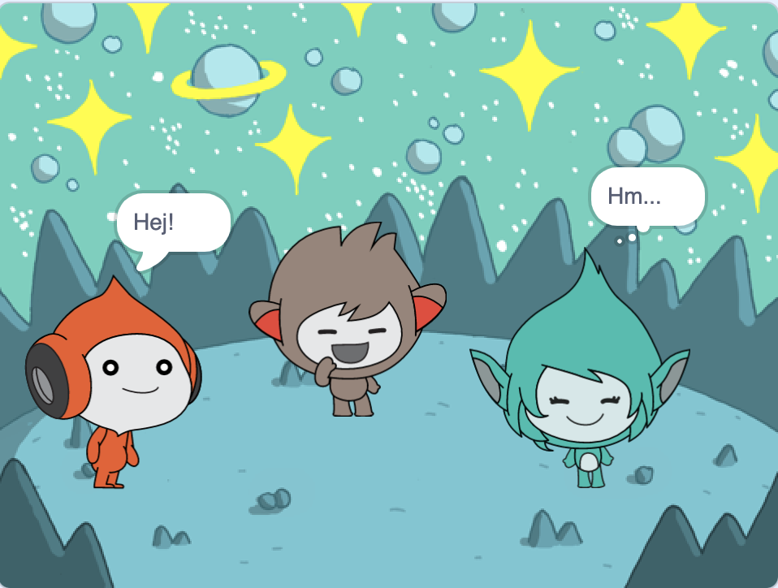
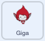

## Giga byter färg

<div style="display: flex; flex-wrap: wrap">
<div style="flex-basis: 200px; flex-grow: 1; margin-right: 15px;">
Sprajts kan även använda tankebubblor och ändra färger för att visa sin personlighet. Du kommer få Giga att göra detta.
</div>
<div>

{:width="300px"}

</div>
</div>

### Få Giga att ändra färg

--- task ---

Lägg till **Giga**sprajten.

Dra **Giga**sprajten till höger sida av scenen.

--- /task ---

--- task ---

Se till att du har **Giga**sprajten vald i sprajtlistan under scenen. Lägg till den här koden för att få **Giga**sprajten att kommunicera genom att byta färg:



```blocks3
when this sprite clicked
set [color v] effect to [0] // 0 is the starting colour
think [Hmm...] for [2] seconds 
clear graphic effects // back to the starting colour
```

--- /task ---

**Tips:** Klicka på sprajten i sprajtlistan under scenen innan du lägger till eller ändrar kod, klädsel eller ljud. Se till att du har klickat på rätt sprajt.

--- task ---

Prova olika tal från `1` till `200` i `ändra färgeffekten till`{:class="block3looks"}blocket tills du hittar en färg som du gillar.

--- /task ---

--- task ---

Ändra orden och antalet sekunder i blocket `tänk`{:class="block3looks"}.

--- /task ---

--- task ---

**Test:** Klicka på **Giga**sprajten på scenen och kontrollera att den ändrar färg och visar en tankebubbla.

--- /task ---

