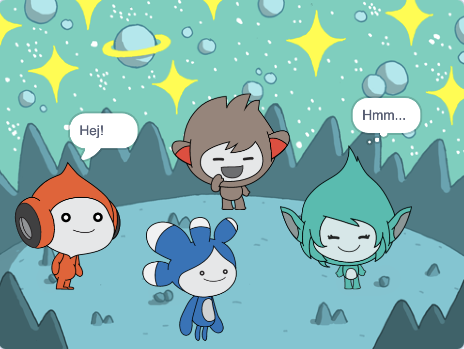

## Uppgradera ditt projekt

<div style="display: flex; flex-wrap: wrap">
<div style="flex-basis: 200px; flex-grow: 1; margin-right: 15px;">
Lägg till **Tera**-sprajten och använd något av de block du har lärt dig om för att skapa en ny gest för **Tera**-sprajten.
</div>
<div>

{:width="300px"}

</div>
</div>

Du kan också använda tillägget Text till tal för att få **Tera** att tala högt:

[[[scratch3-text-to-speech]]]

**Tera**sprajtens personlighet är upp till dig, så ha kul med dina egna kreativa idéer.

```blocks3
when this sprite clicked

say [Hello!] for [2] seconds

say [Hello!]

say [] // hide speech bubble

think [Hmm...] for [2] seconds

switch costume to [tera-d v]

wait (1) seconds // 0.5 is half a second

set [color v] effect to [0] // number up to 200

clear graphic effects

play sound [pop v] until done

start sound [pop v]

speak [hello]
```

Du kan också "remixa" projektet för att göra ändringar du vill. Du kan ändra bakgrunden och hur sprajter gestikulerar, och till och med välja olika sprajter och ge dem gester.

**Tips:** Klicka på en sprajt i sprajtlistan under scenen för att ändra koden, klädslarna och ljudet för den sprajten.

--- collapse ---
---
titel: Avslutat projekt
---

Du kan se det [avslutade projektet här](https://scratch.mit.edu/projects/485673032/){:target="_blank"}.

--- /collapse ---

--- save ---
