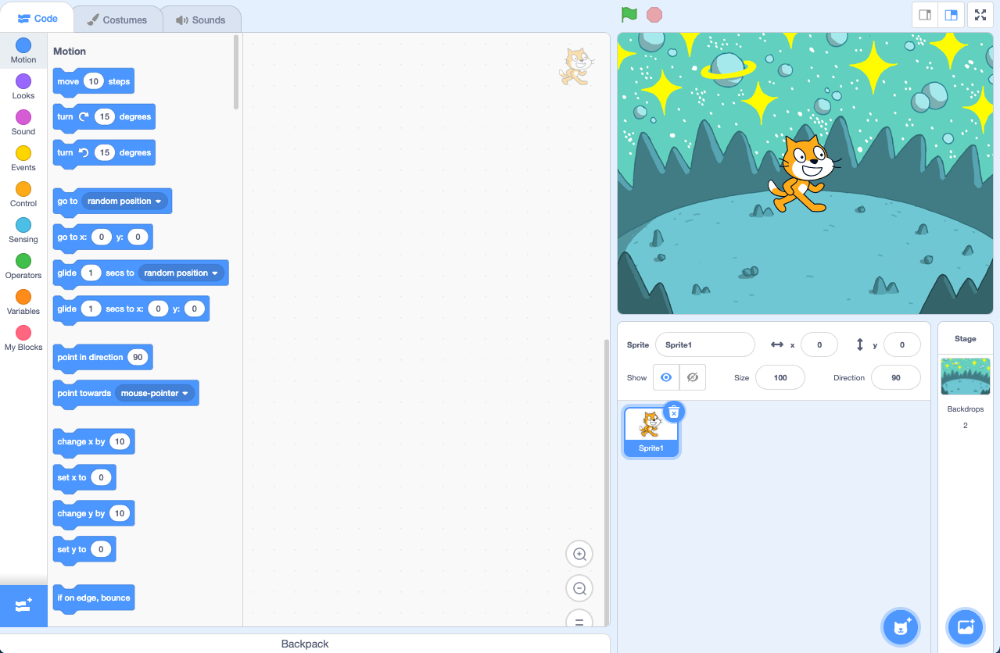
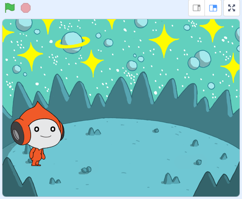

## మీ దృశ్యాన్ని సృష్టించండి

ఈ దశలో, మీరు మీ ప్రాజెక్ట్‌ను Space బ్యాక్‌డ్రాప్ మరియు మొదటి sprite తో సెటప్ చేస్తారు. 

{:width="300px"}

--- task ---

[Space talk స్టార్టర్ ప్రాజెక్ట్ ](https://scratch.mit.edu/projects/582213331/editor){:target="_blank"} ని తెరవండి. Scratch మరొక బ్రౌజర్ ట్యాబ్‌లో తెరవబడుతుంది.

[[[working-offline]]]

--- /task ---

Scratch ఎడిటర్ ఇలా కనిపిస్తుంది:

**Stage** అనేది మీ ప్రాజెక్ట్ అమలయ్యే ప్రదేశం. **backdrop** Stage కనిపించే విధానాన్ని మారుస్తుంది.

--- task ---

Stage పేన్‌లో </strong> Choose a Backdrop** పై క్లిక్ చేయండి (లేదా టాబ్లెట్‌లో అయితే, నొక్కండి):

--- /task ---

--- task ---

**Space** వర్గంపై క్లిక్ చేయండి లేదా సెర్చ్ బాక్సులో`Space` టైప్ చేయండి:

--- /task ---

మన ఈ ఉదాహరణలో, మనము **Space** బ్యాక్‌డ్రాప్‌ని ఎంచుకున్నాము, కానీ మీరు ఎక్కువగా ఇష్టపడే బ్యాక్‌డ్రాప్‌ను ఎంచుకోవచ్చు.

--- task ---

మీ ప్రాజెక్ట్‌కి జోడించడానికి మీరు ఎంచుకున్న బ్యాక్‌డ్రాప్‌పై క్లిక్ చేయండి. మీరు ఎంచుకున్న నేపథ్యాన్ని Stage చూపాలి:

--- /task ---

మీ ప్రాజెక్ట్‌లో ఇప్పటికే చేర్చబడిన sprite ని మీరు చూడగలరా? అది Scratch Cat.

--- task ---

**Sprite1** (Scratch Cat) Sprite ను తొలగించండి: Stage దిగువన ఉన్న Sprite జాబితాలో **Sprite1** ను ఎంచుకొని, **Delete** చిహ్నంపై క్లిక్ చేయండి.

--- /task ---

--- task ---

Sprite జాబితాలో **Choose a Sprite** పై క్లిక్ చేయండి:

--- /task ---

--- task ---

**Fantasy** వర్గాన్ని ఎంచుకోండి. వాటిని మీ ప్రాజెక్ట్‌కి జోడించడానికి **Pico** sprite పై క్లిక్ చేయండి.

--- /task ---

--- task ---

**Pico** sprite ని Stage కి ఎడమ వైపున ఉంచడానికి డ్రాగ్ చేయండి. మీ Stage ఇలా ఉండాలి:

--- /task ---

--- task ---

మీరు మీ Scratch ఖాతాకు సైన్ ఇన్ చేసి ఉంటే, ఆకుపచ్చ Remix బటన్‌పై క్లిక్ చేయండి. ఇది ప్రాజెక్ట్ కాపీని మీ Scratch ఖాతాలో సేవ్ చేస్తుంది.

స్క్రీన్ పైభాగంలో ఉన్న ప్రాజెక్ట్ పేరు గల బాక్సులో మీ ప్రాజెక్ట్ పేరును టైప్ చేయండి.

**చిట్కా:** మీ ప్రాజెక్ట్‌లకు ఉపయోగకరమైన పేర్లను ఇవ్వండి, తద్వారా మీరు చాలా ప్రాజెక్ట్‌లను కలిగి ఉన్నప్పుడు వాటిని సులభంగా కనుగొనవచ్చు.

తర్వాత, మీ ప్రాజెక్ట్‌ను సేవ్ చేయడానికి **File**పై క్లిక్ చేసి, ఆపై **Save now** పై క్లిక్ చేయండి.

మీకు ఒకవేళ ఇంటర్నెట్ లేకపోతే లేదా మీకు ఒక Scratch ఖాతా లేకపోతే, **save to your computer** మీద క్లిక్ చేసి, ప్రాజెక్ట్ యొక్క ఒక కాపీని సేవ్ చేయవచ్చు.

--- /task ---

