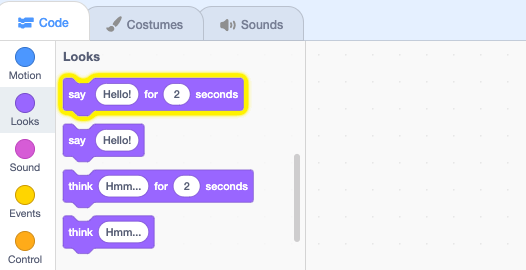

## Pico, హలో అని చెప్తూంది

<div style="display: flex; flex-wrap: wrap">
<div style="flex-basis: 200px; flex-grow: 1; margin-right: 15px;">
ఒక sprite, అది కనిపించే విధానాన్ని మరియు అది చేసే విధానాన్ని మార్చగలిగేలా, కోడ్, costumes, ధ్వనులను కలిగి ఉంటుంది,. 
  
Sprite ని క్లిక్ చేసినప్పుడు పదాలు మరియు ధ్వనిని ఉపయోగించి, Picoను ఎమోట్ చేయడానికి మీరు కోడ్ బ్లాక్‌లను జోడిస్తారు.
</div>
<div>

{:width="300px"}

</div>
</div>

బ్లాక్‌లను ఉపయోగించడానికి, మీరు బ్లాక్‌ల మెనులో ఆయా వాటిపై క్లిక్ చేయవచ్చు.

--- task ---

`Looks`{:class="block3looks"} బ్లాక్స్ మెనుని తెరవండి.

`say`{:class="block3looks"} `hello!``for`{:class="block3looks"} `2` `seconds`{:class="block3looks"} బ్లాక్ పై క్లిక్ చేయండి.



**Pico** sprite రెండు సెకన్ల పాటు స్పీచ్ బబుల్‌ను చూపుతుంది.


**చిట్కా:** Scratch లోని కోడ్ బ్లాక్‌లు రన్ అవుతున్నప్పుడు పసుపు రంగు అవుట్‌లైన్‌తో మెరుస్తాయి.

--- /task ---

మీరు బ్లాక్‌లను కోడ్ ప్రాంతానికి డ్రాగ్ చేయవచ్చు మరియు వాటిని అక్కడ నుండి ఉపయోగించవచ్చు.

--- task ---

`say`{:class="block3looks"} `hello!` `for`{:class="block3looks"} `2` `seconds`{:class="block3looks"} బ్లాక్ పై క్లిక్ చేయండి. దానిపై మళ్లీ క్లిక్ చేయండి.


--- /task ---

ఒకే సమయంలో ఒకటి కంటే ఎక్కువ అమలు చేయడానికి బ్లాక్‌లను కోడ్ ప్రాంతంలో కలిపి కనెక్ట్ చేయవచ్చు. కనెక్ట్ చేయబడిన బ్లాక్‌లు పై నుండి క్రిందికి క్రమంలో అమలవుతాయి.

--- task ---

`Events`{:class="block3events"} బ్లాక్‌ల మెను నుండి `when this sprite clicked`{:class="block3events"} బ్లాక్‌ని డ్రాగ్ చేయండి మరియు కోడ్ ప్రాంతంలో `say`{:class="block3looks"} కి పై భాగంలో కనెక్ట్ చేయండి. బ్లాక్‌లు కలిసి స్నాప్ అవుతాయి.


```blocks3
+when this sprite clicked
say [Hello!] for [2] seconds // hide speech after 2 seconds
```

--- /task ---

వ్యాఖ్య లేదా కామెంట్ అనేది మీ కోడ్ ఏమి చేస్తుందో తెలియజెప్పే వివరణ.

```blocks3
say [Hello!] for [2] seconds // hide speech after 2 seconds
```
మీరు కోడ్ ఉదాహరణలలో వ్యాఖ్యలను చూస్తారు. మీరు మీ ప్రాజెక్ట్‌కి కోడ్‌ను జోడించినప్పుడు మీరు వ్యాఖ్యలను జోడించాల్సిన అవసరం లేదు.

మీరు మీ ప్రాజెక్ట్‌ను పూర్తి చేసినప్పుడు మీకు సమయం ఉంటే, మీ కోడ్‌కి వ్యాఖ్యలను జోడించడం మంచిది, తద్వారా తర్వాత సులభంగా అర్థం చేసుకోవచ్చు. వ్యాఖ్యను జోడించడానికి, Code ప్రాంతంలోని బ్లాక్‌పై రైట్-క్లిక్ (లేదా టాబ్లెట్‌పై, నొక్కి పట్టుకోండి) మరియు **Add comment** ను ఎన్నుకోండి.


--- task ---

**పరీక్ష:** **Pico** sprite పై క్లిక్ చేసి, స్పీచ్ బబుల్ రెండు సెకన్ల పాటు కనిపిస్తుందో లేదో తనిఖీ చేయండి. మీ కోడ్ మీరు ఆశించిన విధంగా చేస్తుందో లేదో నిర్ధారించుకోవడానికి పరీక్షించడం చాలా ముఖ్యం.

--- /task ---

--- save ---
