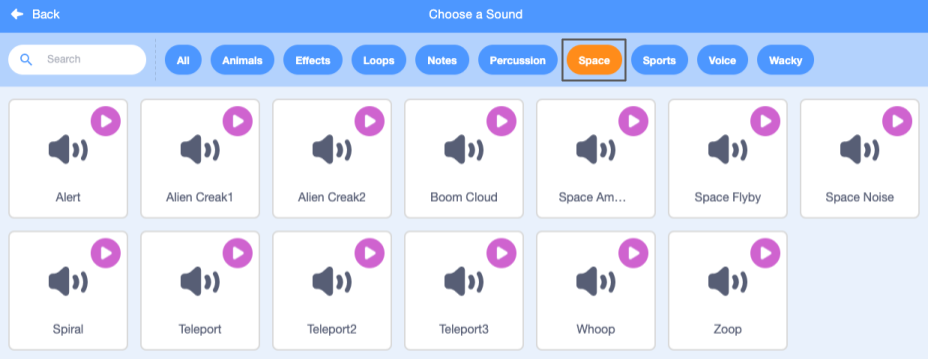
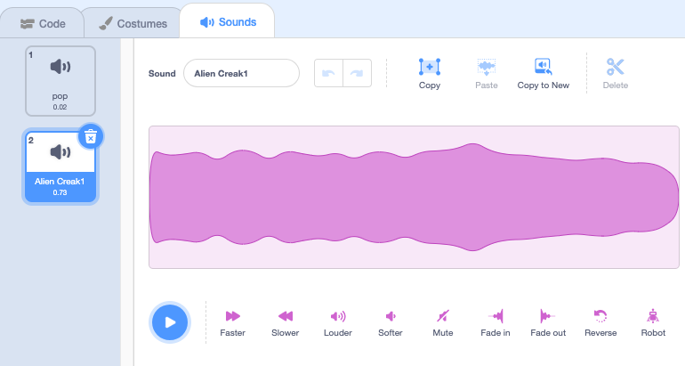
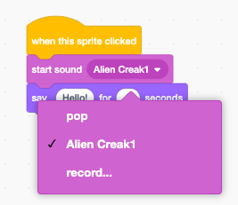

## Pico ధ్వనిని ప్లే చేస్తుంది

<div style="display: flex; flex-wrap: wrap">
<div style="flex-basis: 200px; flex-grow: 1; margin-right: 15px;">
కమ్యూనికేట్ చేయడానికి మరొక మార్గం ధ్వనిని ఉపయోగించడం.
</div>
<div>

{:width="300px"}

</div>
</div>

--- task ---

**Pico** sprite కోసం **Sounds** ట్యాబ్‌పై క్లిక్ చేయండి మరియు మీరు **pop** సౌండ్‌ను కనుగొంటారు. **pop** సౌండ్ వినడానికి **Play** చిహ్నంపై క్లిక్ చేయండి.


--- /task ---

Scratch లో కొన్ని అద్భుతమైన అన్య ధ్వనులు ఉన్నాయి, వీటిని మీరు మీ sprite కి జోడించవచ్చు.

--- task ---

కొత్త ధ్వనిని ఎంచుకోవడానికి, **Choose a Sound** చిహ్నంపై క్లిక్ చేసి, **Space** వర్గాన్ని ఎంచుకోండి లేదా సెర్చ్ బాక్సులో `space` అని టైప్ చేయండి.




--- /task ---

--- task ---

**Play** చిహ్నాలను ఉపయోగించి కొన్ని విభిన్న ధ్వనులను ప్లే చేయండి. మీరు ఉపయోగించాలనుకుంటున్న ధ్వనిని మీరు కనుగొన్న తర్వాత, దాన్ని మీ ప్రాజెక్ట్‌కి జోడించడానికి దానిపై క్లిక్ చేయండి.



--- /task ---

--- task ---

**Code** ట్యాబ్‌పై క్లిక్ చేయండి. `Sound`{:class="block3sound"} బ్లాక్స్ మెనులో, `start sound`{:class="block3sound"} బ్లాక్‌ని కనుగొనండి.

కోడ్ ప్రాంతంలో బ్లాక్ ను `when this sprite clicked`{:class="block3events"} బ్లాక్ మరియు `say`{:class="block3looks"} బ్లాక్ మధ్యకు డ్రాగ్ చేయండి. గ్యాప్ తెరవబడుతుంది మరియు బ్లాక్ సరైన స్థానంలోనికి స్నాప్ అవుతుంది.


మీ ప్రాజెక్ట్ ఇలా కనిపించాలి:


```blocks3
when this sprite clicked
+start sound [Alien Creak1 v] 
say [Hello!] for [2] seconds // 2 సెకన్ల తర్వాత ప్రసంగాన్ని దాచండి
```

--- /task ---

--- task ---

మీ `start sound`{:class="block3sound"} బ్లాక్‌లో మీరు ఎంచుకున్న ధ్వని ఉందో లేదో తనిఖీ చేయండి. అలా లేకపోతే, మీరు `start sound`{:class="block3sound"} బ్లాక్‌లోని sound పై క్లిక్ చేయాలి, ఆపై డ్రాప్-డౌన్ మెనులో మీరు కోరుకున్న ధ్వనిని ఎంచుకోండి.



--- /task ---

--- task ---

**పరీక్ష:** **Pico** sprite పై క్లిక్ చేసి, స్పీచ్ బబుల్ రెండు సెకన్ల పాటు కనిపిస్తుందో లేదో తనిఖీ చేయండి. మీకు ధ్వని వినిపించకపోతే, `start sound`{:class="block3sound"} బ్లాక్‌ని `when this sprite clicked`{:class="block3events"} బ్లాక్‌ కింద జోడించారని నిర్ధారించుకోండి. అలాగే, మీ కంప్యూటర్ లేదా టాబ్లెట్‌లో ధ్వని పని చేస్తుందో లేదో తనిఖీ చేయండి.

--- /task ---

--- save ---

