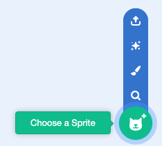
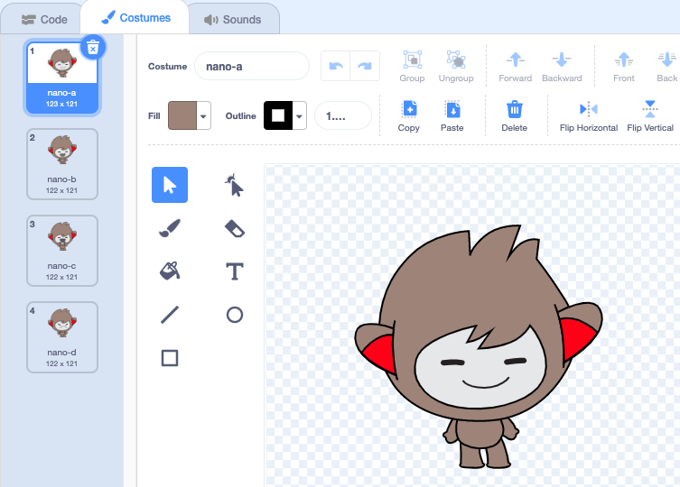
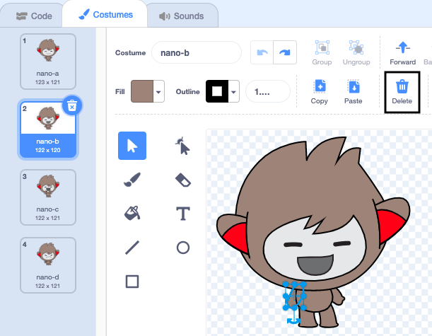
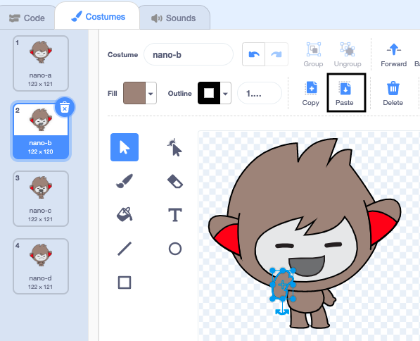

## Nano switches costume

<div style="display: flex; flex-wrap: wrap">
<div style="flex-basis: 200px; flex-grow: 1; margin-right: 15px;">

Get Nano to emote by switching **costumes**.

Sprite లు కనిపించే విధానాన్ని మార్చడానికి **costumes**ని కలిగి ఉంటాయి. To animate a sprite, you can change its costume.

</div>
<div>

{:width="300px"}

</div>
</div>

### Nano signs "Thanks!"

--- task ---

**Fantasy** వర్గం నుండి మీ ప్రాజెక్ట్‌కి **Nano** sprite ని జోడించండి.



--- /task ---

--- task ---

Stage దిగువన ఉన్న Sprite జాబితాలో **Nano** sprite ఎంచుకోబడిందని నిర్ధారించుకోండి.


Click on the **Code** tab and add a script to get the **Nano** sprite to sign 'Thanks' using `switch costume to`{:class="block3looks"} and `wait`{:class="block3control"}:


```blocks3
when this sprite clicked // when Nano is clicked
switch costume to [nano-b v] // Nano talking
wait (0.5) seconds // try 0.25 instead of 0.5
switch costume to [nano-a v] // Nano smiling
```
--- /task ---

**Tip:** All the blocks are colour-coded, so you will find the `switch costume to`{:class="block3looks"} block in the `Looks`{:class="block3looks"} blocks menu and the `wait`{:class="block3control"} block in the `Control`{:class="block3control"} blocks menu.

--- task ---

**Test:** Click on the **Nano** sprite on the Stage and check that Nano's costume changes.

--- /task ---

### Nano సంకేత భాషను ఉపయోగిస్తుంది

<p style="border-left: solid; border-width:10px; border-color: #0faeb0; background-color: aliceblue; padding: 10px;">కమ్యూనికేట్ చేయడానికి మిలియన్ల మంది ప్రజలు సంకేత భాషను ఉపయోగిస్తున్నారు. A common way to sign 'Thank you' is to place your fingers on your chin with your hand as flat as possible. You then move your hand forwards, away from your chin and slightly down. 
</p>

<!-- Add a video of someone signing -->

Nano costumes మార్చడం ద్వారా సంకేత భాషను ఉపయోగిస్తుంది.

మీరు పెయింట్ ఎడిటర్‌తో మీ sprite ల కోసం costume లను సవరించవచ్చు. "ధన్యవాదాలు" అని సంకేతం చేయడానికి మీరు Nano costume లను ఎడిట్ చేస్తారు.

--- task ---

**Nano** sprite కోసం costume లను చూడటానికి **Costumes** ట్యాబ్‌పై క్లిక్ చేయండి:



--- /task ---

--- task ---

**nano-b** costume పై క్లిక్ చేయండి. ఎడమ వైపున ఉన్న చేతిపై క్లిక్ చేసి, ఆపై **Delete**పై క్లిక్ చేయండి.



costume ఇలా కనిపించాలి:


--- /task ---

**చిట్కా:** మీరు పెయింట్ ఎడిటర్‌లో పొరపాటు చేస్తే, మీరు **Undo**పై క్లిక్ చేయవచ్చు.


--- task ---

**nano-c** costume కి వెళ్లి, ఎడమ వైపున ఉన్న చేతిపై క్లిక్ చేసి, ఆపై **Copy**పై క్లిక్ చేయండి.


--- /task ---

--- task ---

**nano-b** costume కి తిరిగి వెళ్లి, **Paste**పై క్లిక్ చేయండి. costume ఇలా కనిపించాలి:



--- /task ---

--- task ---

**పరీక్ష:** Stage పై గల **Nano** sprite పై క్లిక్ చేసి, స్పీచ్ బబుల్ కనిపిస్తుందో లేదో తనిఖీ చేయండి మరియు మీరు ఎడిట్ చేసిన costume కి Nano costume మారుతుందో లేదో తనిఖీ చేయండి.

--- /task ---

<p style="border-left: solid; border-width:10px; border-color: #0faeb0; background-color: aliceblue; padding: 10px;">"ధన్యవాదాలు" అని ఎలా సంకేతం చేయాలో మీరు నేర్చుకున్నారు. తదుపరిసారి మీరు ఎవరికైనా ధన్యవాదాలు చెప్పడానికి, మీ కొత్త నైపుణ్యాన్ని ఎందుకు ఉపయోగించకూడదు?
</p>

