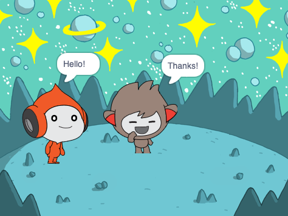

## Nano costumes ని మార్చుకుంటుంది

<div style="display: flex; flex-wrap: wrap">
<div style="flex-basis: 200px; flex-grow: 1; margin-right: 15px;">

Get Nano to emote by switching **costumes**.

Sprite లు కనిపించే విధానాన్ని మార్చడానికి **costumes**ని కలిగి ఉంటాయి. They are usually slightly different images of the same sprite. To animate a sprite, you can change its costume.

</div>
<div>

{:width="300px"}

</div>
</div>

--- task ---

**Fantasy** వర్గం నుండి మీ ప్రాజెక్ట్‌కి **Nano** sprite ని జోడించండి.


--- /task ---

--- task ---

Stage దిగువన ఉన్న Sprite జాబితాలో **Nano** sprite ఎంచుకోబడిందని నిర్ధారించుకోండి.


Click on the **Code** tab and add a script to get the **Nano** sprite to change costume using `switch costume to`{:class="block3looks"} and `wait`{:class="block3control"}. Use the drop down menu to switch between `nano-b`{:class="block3looks"} and `nano-a`{:class="block3looks"}:


```blocks3
when this sprite clicked // when Nano is clicked
switch costume to (nano-b v) // Nano talking
wait (0.5) seconds // try 0.25 instead of 0.5
switch costume to (nano-a v) // Nano smiling
```
--- /task ---

**చిట్కా:** అన్ని బ్లాక్స్, విభిన్న రంగులను కలిగి ఉంటాయి కాబట్టి మీరు, `switch costume to`{:class="block3looks"} బ్లాక్ ను `Looks`{:clas="block3looks"} బ్లాక్స్ మెనులో కనుగొంటారు.

--- task ---

**పరీక్ష:** **Nano** sprite పై క్లిక్ చేసి, స్పీచ్ బబుల్ రెండు సెకన్ల పాటు కనిపిస్తుందో లేదో తనిఖీ చేయండి.

--- /task ---
