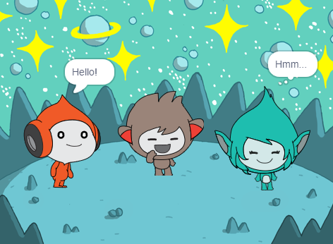

## Giga రంగులు మారుస్తుంది

<div style="display: flex; flex-wrap: wrap">
<div style="flex-basis: 200px; flex-grow: 1; margin-right: 15px;">
Sprite లు థాట్ బబుల్స్ ని కూడా ఉపయోగించవచ్చు మరియు వాటి వ్యక్తిత్వాన్ని చూపించడానికి రంగులను మార్చవచ్చు. దీన్ని చేయడానికి మీరు Gigaని పొందుతారు.
</div>
<div>

{:width="300px"}

</div>
</div>

--- task ---

**Giga** sprite ని జోడించండి.

**Giga** sprite ని Stage కుడి వైపుకు డ్రాగ్ చేయండి.

--- /task ---

--- task ---

మీరు Stage దిగువన ఉన్న Sprite లిస్ట్‌లో **Giga** ఉందని నిర్ధారించుకోండి. రంగును మార్చడం ద్వారా **Giga** sprite కమ్యూనికేట్ చేయడానికి ఈ కోడ్‌ని జోడించండి:


```blocks3
when this sprite clicked
set [color v] effect to [0] // 0 అనేది ప్రారంభ రంగు
think [Hmm...] for [2] seconds 
clear graphic effects // తిరిగి ప్రారంభ రంగుకి
```

--- /task ---

**చిట్కా:** మీరు కోడ్, costume లేదా ధ్వనిని జోడించడానికి లేదా మార్చడానికి ముందు Stage దిగువన ఉన్న Sprite జాబితాలోని sprite పై క్లిక్ చేయండి. మీరు సరైన sprite పై క్లిక్ చేశారని నిర్ధారించుకోండి.

--- task ---

`set color effect to`{:class="block3looks"} బ్లాక్‌ లో మీకు నచ్చిన కలర్ దొరికే వరకు `1` నుండి `200` వరకు విభిన్న సంఖ్యలను ప్రయత్నించండి.

--- /task ---

--- task ---

`think`{:class="block3looks"} బ్లాక్‌లోని పదాలు మరియు సెకన్ల సంఖ్యను మార్చండి.

--- /task ---

--- task ---

**పరీక్ష:** Stage పై గల **Giga** sprite పై క్లిక్ చేయండి మరియు sprite రంగును మారుస్తుందో లేదో తనిఖీ చేయండి మరియు థాట్ బబుల్‌ను చూపుతుంది.

--- /task ---

--- save ---
