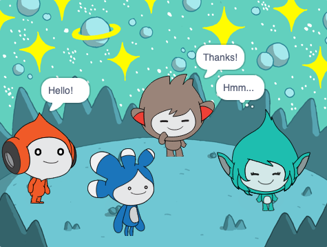

## తర్వాత ఏంటి?

<div style="display: flex; flex-wrap: wrap">
<div style="flex-basis: 200px; flex-grow: 1; margin-right: 15px;">
Add the **Tera** sprite and use any of the blocks that you have learned about to make an 'emote' for the **Tera** sprite.
</div>
<div>

{:width="300px"}

</div>
</div>

You could also use the Text to Speech extension to make **Tera** speak out loud:

[[[scratch3-text-to-speech]]]

The **Tera** sprite's personality is your choice, so have fun using your own creative ideas.

```blocks3
when this sprite clicked

say [Hello!] for [2] seconds

say [Hello!]

say [] // hide speech bubble

think [Hmm...] for [2] seconds

switch costume to [tera-d v]

wait (1) seconds // 0.5 is half a second

set [color v] effect to [0] // number up to 200

clear graphic effects

play sound [pop v] until done

start sound [pop v]

speak [hello]
```

You can also 'remix' the project to make any changes you like. You could change the backdrop, and how the sprites emote, and even choose different sprites and give them emotes.

--- no-print ---

--- collapse ---
---
title: Completed project
---

మీరు సరదాగా Scratch అన్వేషించాలనుకొంటే, అప్పుడు మీరు [ఈ ప్రాజెక్టు](https://projects.raspberrypi.org/te-IN/projects?software%5B%5D=scratch&curriculum%5B%5D=%201) లలో ఏదైనా ప్రయత్నించండి.

--- /collapse ---

--- save ---
