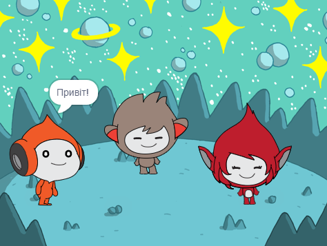

## What you will make

Створиш космічну сцену з персонажами 👾, які 'емоційно' діляться своїми думками чи почуттями.

У Scratch персонажі та об'єкти називаються **спрайтами**, і вони з'являються на **Сцені**.

Зможеш:
+ Додати спрайти та **тло**, щоб створити свій проєкт
+ Натискати на спрайти, щоб змусити їх спілкуватися за допомогою блоків коду `Вигляд`{:class="block3looks"} та `Звук`{:class="block3sound"}
+ Використовуй **Редактор Малювання**, щоб змінити **образ**

--- no-print --- --- task ---
### Грати ▶️

  
Натисни на кожного спрайта, щоб побачити, що він робить. 

Що станеться, якщо клацнути по одному спрайту, а потім швидко клацнути по іншому спрайту?

  <iframe allowtransparency="true" width="485" height="402" src="https://scratch.mit.edu/projects/embed/485673032/?autostart=false" frameborder="0"></iframe>

--- /task --- --- /no-print ---

--- print-only ---

--- /print-only ---

