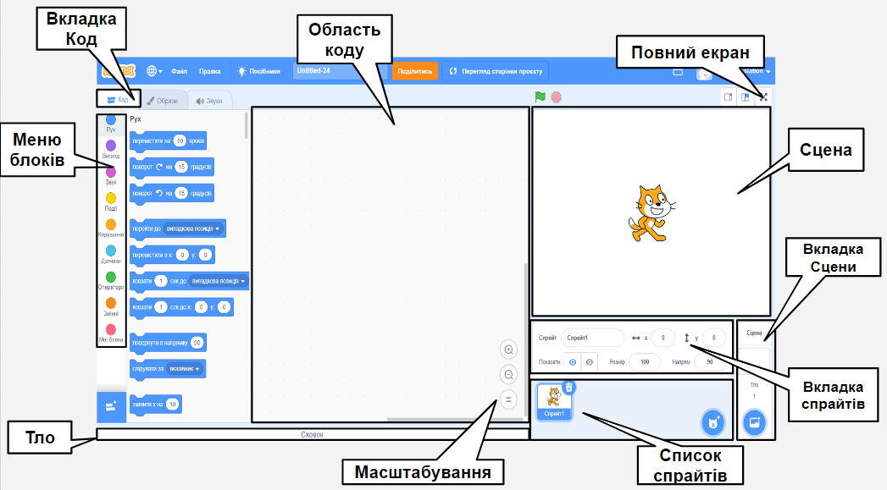
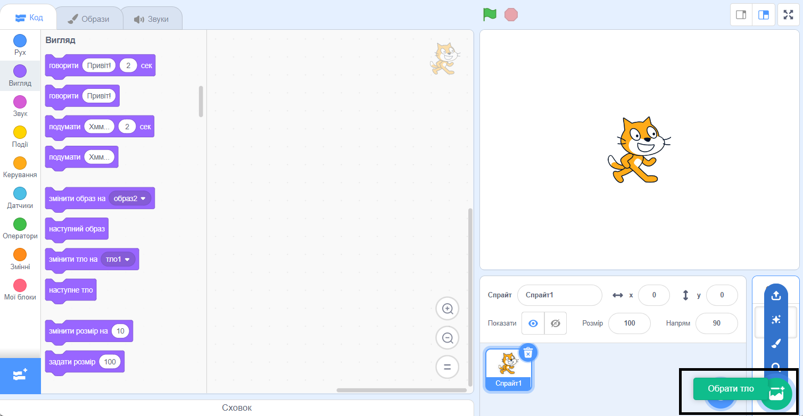
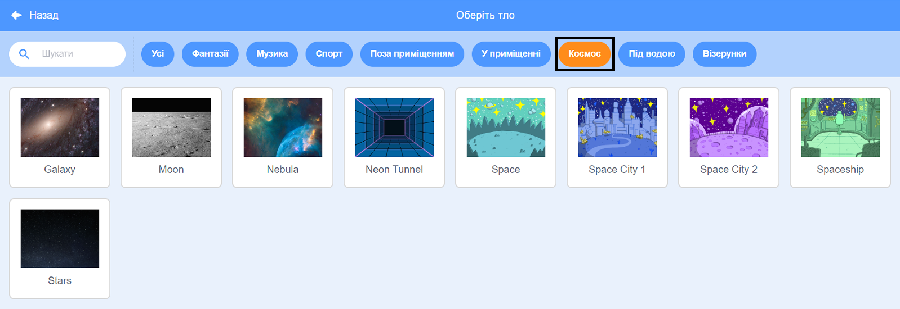
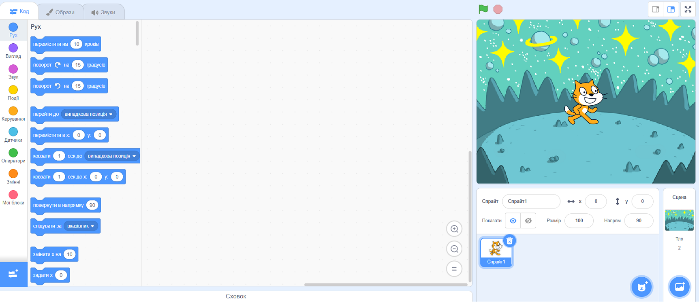
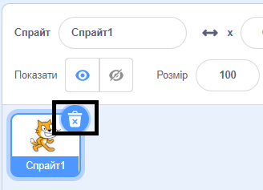
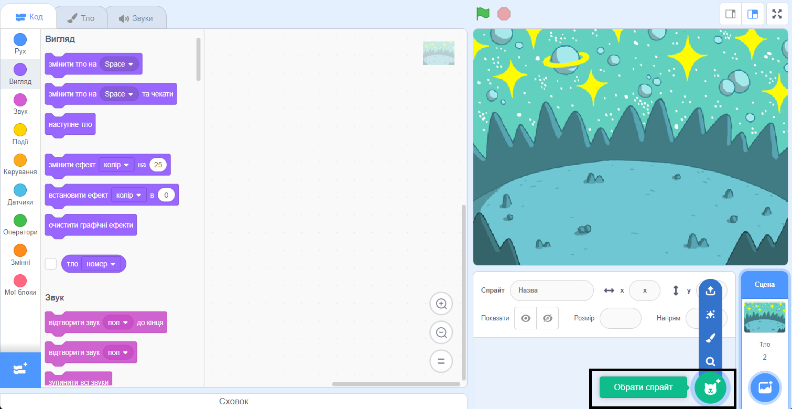
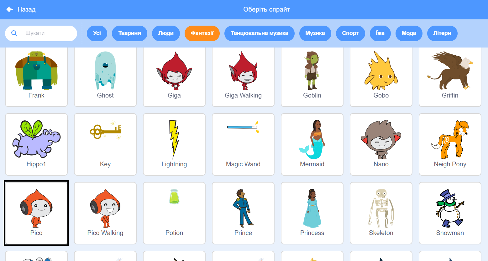
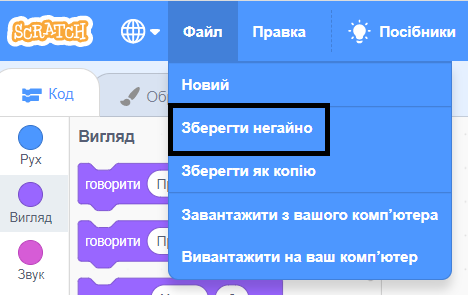

## Створення своєї сцени

Налаштуй свій проєкт за допомогою космічного фону та першого спрайта. 

{:width="300px"}

### Відкрий початковий проєкт

--- task ---

Відкрий [Стартовий проєкт Космічна розмова](https://scratch.mit.edu/projects/582213331/editor){:target="_blank"}. Scratch відкриється в іншій вкладці браузера.

[[[working-offline]]]

--- /task ---

### Редактор Scratch

### Додай тло

**Сцена** - це місце, де виконується твій проєкт. **Тло** змінює зовнішній вигляд Сцени.

--- task ---

Клацни (або на планшеті торкнись) на **Обрати тло** на панелі Спрайтів:

--- /task ---

--- task ---

Клацни на категорію **Космос** category або введи у поле пошуку `space`:

--- /task ---

У нашому прикладі ми обрали тло **Space**, але ти обирай той фон, який тобі найбільше подобається.

--- task ---

Натисни на обране тло, щоб додати його до свого проєкту. На Сцені має бути зображено тло, яке було обрано:

--- /task ---

### Додай спрайт

Ти бачиш спрайт, який вже включений у твій проєкт? Це кіт Scratch.

--- task ---

Видали спрайт **Спрайт1** (Кіт Scratch): вибери спрайт **Спрайт1** у списку Спрайтів під Сценою та натисни на іконку **Видалити**.

--- /task ---

--- task ---

Клацни на **Обрати спрайт** у списку Спрайтів:

--- /task ---

--- task ---

Вибери категорію **Фантазії**. Клацни на спрайт **Pico**, щоб додати його до свого проєкту.

--- /task ---

--- task ---

Перетягуй спрайт **Pico**, щоб розмістити його з лівого боку Сцени. Твоя Сцена повинна виглядати приблизно так:

--- /task ---

--- task ---

**Збереження**: Якщо ти увійшов до свого облікового запису Scratch, натисни на зелену кнопку Ремікс. Це збереже копію проєкту у твоєму обліковому записі Scratch.

Введи назву твого проєкту в поле для назви проєкту у верхній частині екрана.

**Порада:** Давай проєктам зрозумілі назви, щоб їх можна було легко знайти, коли у тебе буде багато проєктів.

Далі, натисни на **Файл**, а потім на **Зберегти негайно**, щоб зберегти свій проєкт.

Якщо ти зараз або не маєш облікового запису Scratch, можеш натиснути на **Вивантажити на ваш комп'ютер**, щоб зберегти копію твого проєкту.

--- /task ---

