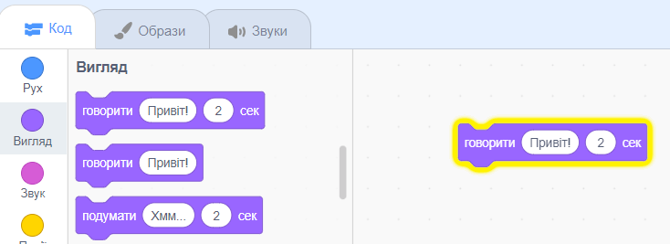

## Pico вітається

<div style="display: flex; flex-wrap: wrap">
<div style="flex-basis: 200px; flex-grow: 1; margin-right: 15px;">
Спрайт може мати код, образи та звуки, які змінюють його зовнішній вигляд та дії. 
  
Додай блоки коду, щоб змусити Pico вимовляти слова та звуки при натисканні на його спрайт.
</div>
<div>

{:width="300px"}

</div>
</div>

<p style="border-left: solid; border-width:10px; border-color: #0faeb0; background-color: aliceblue; padding: 10px;">
<span style="color: #0faeb0">**Емоції**</span> - це спосіб показати особистість персонажа в грі. Вони можуть використовувати мову, звуки, рух та графічні ефекти, як і в Scratch. Чи граєш ти в ігри, які використовують емоції?
</p>

### Використовуй блок говорити

--- task ---

Відкрий меню блоків `Вигляд`{:class="block3looks"}.

Клацни на блок `говорити`{:class="block3looks"}`Привіт!` `на`{:class="block3looks"} `2` `секунд`{:class="block3looks"} блок.


Спрайт **Pico** покаже мовну бульбашку на дві секунди.


**Порада:** У Scratch, блоки коду світяться жовтим контуром під час виконання.

--- /task ---

--- task ---

Перетягни блок `говорити`{:class="block3looks"} `Привіт!` `на`{:class="block3looks"} `2` `секунд`{:class="block3looks"} блок до Області коду. Знову натисни на нього.




--- /task ---

### Зроби так, щоб Pico говорив при натисканні (або торканні)

--- task ---

Перетягни блок `коли спрайт натиснуто`{:class="block3events"} з меню блоків `Події`{:class="block3events"} та з'єднай його з верхньою частиною блока `говорити`{:class="block3looks"} в Області коду. Блоки з'єднаються між собою.


```blocks3
+when this sprite clicked
say [Hello!] for [2] seconds // hide speech after 2 seconds
```

--- /task ---

### Коментарі до коду

--- task ---

```blocks3
say [Hello!] for [2] seconds // hide speech after 2 seconds
```
Ти побачиш коментарі в прикладах коду. Тобі не потрібно писати коментарі при додаванні коду в проєкт.

Якщо у тебе є час, коли ти закінчиш свій проєкт, бажано додати коментарі до свого коду, щоб потім було легше розібратися в ньому. Try adding a comment now. Right-click (or on a tablet, tap and hold) on a block in the Code area and choose **Add Comment**.


--- /task ---

### Тест

--- task ---

**Тест:** Натисни на спрайт **Pico** на Сцені та перевір, щоб мовна бульбашка з'явилася на дві секунди. Важливо тестувати свій код, щоб переконатися, що він працює так, як ти очікуєш.

--- /task ---

--- task ---

Твій проєкт вже збережено і має назву. Scratch тепер буде**автоматично** зберігати проєкт для тебе.

Ти все ще можеш натиснути на кнопку збереження, просто для впевненості.

--- /task ---
