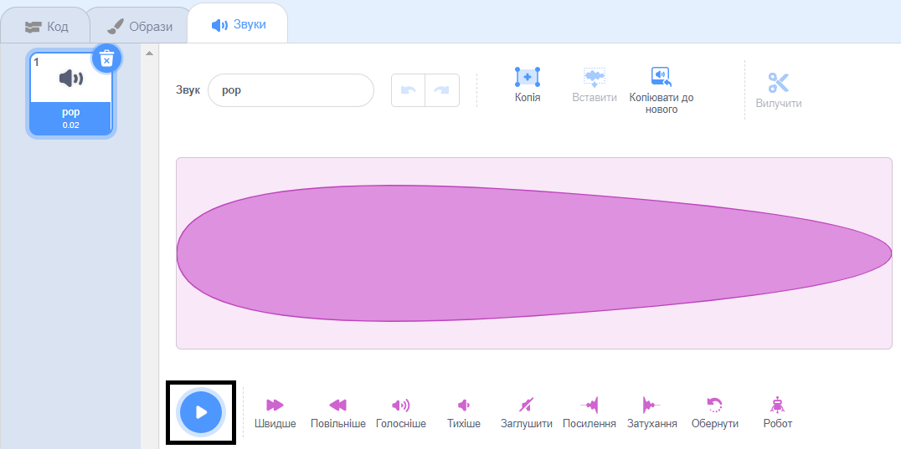
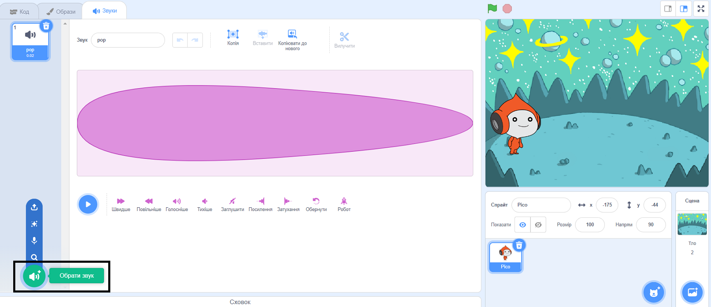
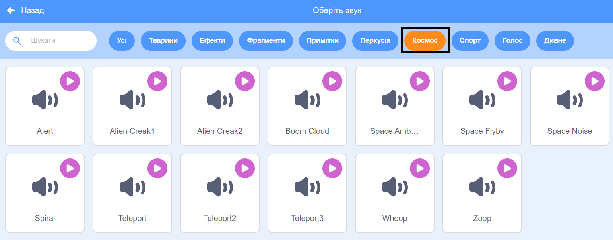
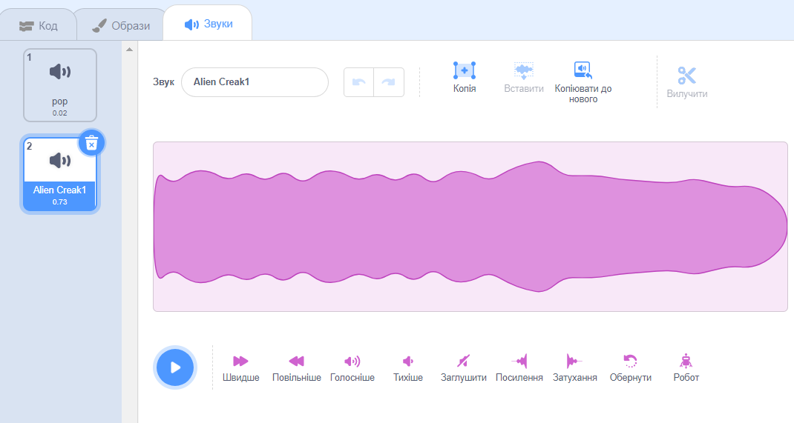
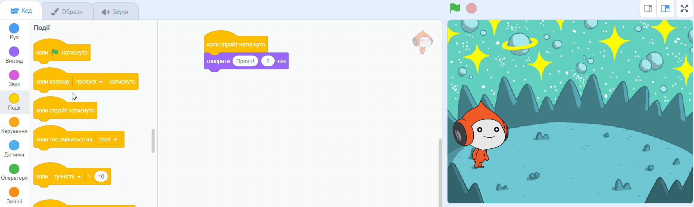
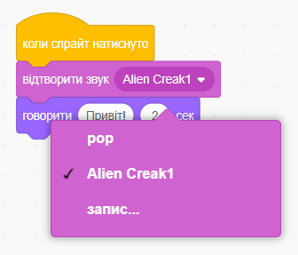

## Pico відтворює звук

<div style="display: flex; flex-wrap: wrap">
<div style="flex-basis: 200px; flex-grow: 1; margin-right: 15px;">
Ще одним способом спілкування є використання звуку.
</div>
<div>

{:width="300px"}

</div>
</div>

### Додай звук до спрайта Pico

--- task ---

Клацни на вкладку**Звуки** для спрайта **Pico** і ти знайдеш звук**pop**. Клацни на іконку **Грати**, щоб прослухати звук **pop**.



**Налагодження**: Якщо ти не чуєш звук, перевір, чи працює звук на твоєму комп'ютері або планшеті.

--- /task ---

--- task ---

Щоб вибрати новий звук, натисни на іконку**Обрати звук** та вибери категорію **Космос** або введи у полі пошуку `space`.






--- /task ---

--- task ---

Відтвори кілька різних звуків за допомогою іконки **Грати**. Після того, як знайдеш звук, який хочеш використати, натисни на нього, щоб додати його до свого проєкту.



--- /task ---

### Зробити так, щоб звук відтворювався при натисканні (або дотику, якщо на планшеті)

--- task ---

Натисни на вкладку **Код**. У меню блоків `Звук`{:class="block3sound"}, знайди блок `відтворити звук`{:class="block3sound"}.

Перетягни блок в область Коду, між блоком`коли спрайт натиснуто`{:class="block3events"} та блоком `говорити`{:class="block3looks"}. Відкриється зазор і блок зафіксується на місці.



Твій код повинен виглядати так:


```blocks3
when this sprite clicked
+start sound [Alien Creak1 v] 
say [Hello!] for [2] seconds // hide speech after 2 seconds
```

--- /task ---

### Протестуй свій код

--- task ---

Переконайся що блок `відтворити звук`{:class="block3sound"} має у ньому вибраний звук. Якщо ні, потрібно натиснути на звук у блоці `відтворити звук`{:class="block3sound"}, та вибрати потрібний тобі звук у спливаючому меню.



--- /task ---

--- task ---

**Тест:** Натисни на спрайт **Pico** і переконайся, що мовна бульбашка з'явилася, і ти чуєш звук. Якщо ти не чуєш звук, переконайся, що ти додав блок `відтворити звук`{:class="block3sound"} під блоком `коли спрайт натиснуто`{:class="block3events"}.

--- /task ---

