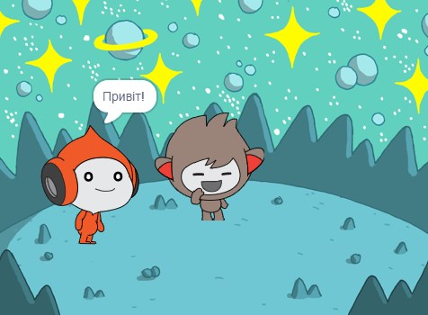
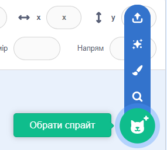
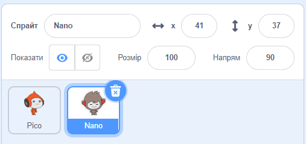
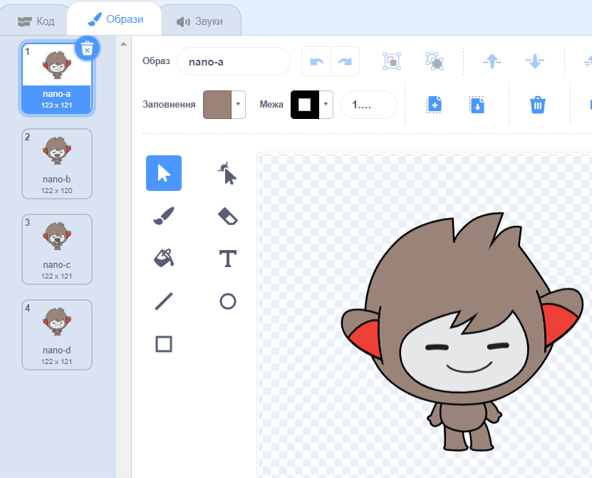
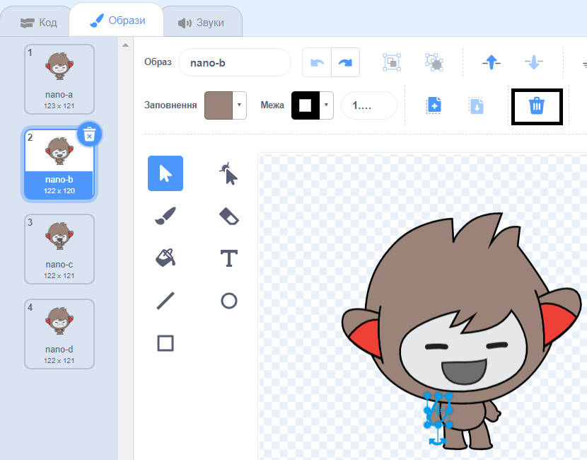
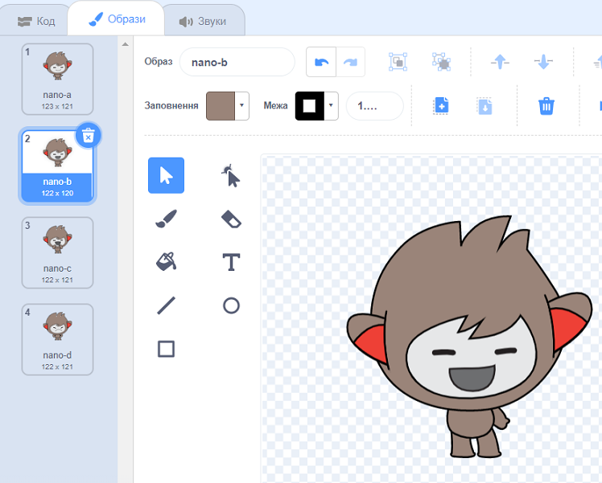
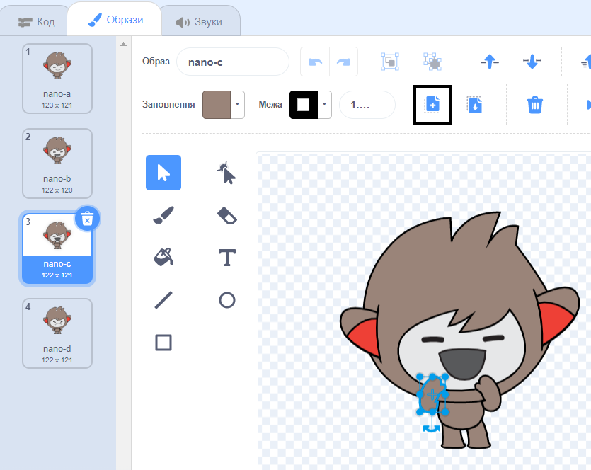
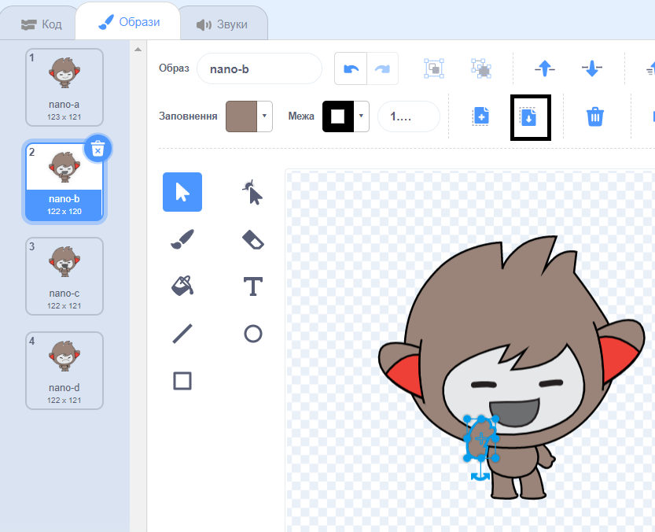

## Nano змінює костюм

<div style="display: flex; flex-wrap: wrap">
<div style="flex-basis: 200px; flex-grow: 1; margin-right: 15px;">

Зроби так, щоб Nano емоційно реагував на зміну **образів**.

Спрайти мають **образи**, щоб змінювати їхній вигляд. They are usually slightly different images of the same sprite. Щоб анімувати спрайт, можна змінювати його образ.

</div>
<div>

{:width="300px"}

</div>
</div>

### Nano говорить "Дякую!"

--- task ---

Додай до проєкту спрайт **Nano** з категорії **Фантазії** category.



--- /task ---

--- task ---

Переконайся, що спрайт **Nano** вибраний у списку Спрайтів під Сценою.



Click on the **Code** tab and add a script to get the **Nano** sprite to sign 'Thanks' using `switch costume to`{:class="block3looks"} and `wait`{:class="block3control"}. Use the drop down menu to switch between `nano-b`{:class="block3looks"} and `nano-a`{:class="block3looks"}:


```blocks3
when this sprite clicked // when Nano is clicked
switch costume to [nano-b v] // Nano talking
wait (0.5) seconds // try 0.25 instead of 0.5
switch costume to [nano-a v] // Nano smiling
```
--- /task ---

**Порада:** Всі блоки мають кольорове позначення, тому ти знайдеш блок `змінити образ на`{:class="block3looks"} у меню блоків `Вигляд`{:class="block3looks"} та блок `чекати`{:class="block3control"} у меню блоків `Вигляд`{:class="block3control"}.

--- task ---

**Тест:** Натисни на спрайт **Nano** на Сцені та перевір, чи змінюється костюм Nano.

--- /task ---

### Nano використовує мову жестів

<p style="border-left: solid; border-width:10px; border-color: #0faeb0; background-color: aliceblue; padding: 10px;">Мільйони людей використовують жестову мову для спілкування. Поширений спосіб сказати "Дякую" - покласти пальці на підборіддя, тримаючи руку якомога рівніше. Потім потрібно відвести руку вперед, від підборіддя і трохи вниз. 
</p>

<!-- Add a video of someone signing -->

Nano буде використовувати мову жестів, змінюючи образи.

Ти можеш редагувати образи для своїх спрайтів за допомогою редактора Малювання. Ти будеш редагувати образ Nano, щоб змусити його сказати "дякую".

--- task ---

Натисни на вкладку **Образи**, щоб побачити образи для спрайта **Nano**:



--- /task ---

--- task ---

Натисни на образ**nano-b**. Натисни на ліву руку, а потім натисни на **Видалити**.



Образ має виглядати так:



--- /task ---

**Порада:** Якщо допущена помилка в редакторі Малювання, можна натиснути на **Скасувати**.


--- task ---

Перейди до образу **nano-c** costume та натисни на ліву руку, потім натисни на **Копія**.



--- /task ---

--- task ---

Повернись до образу **nano-b** та клацни **Вставити**. Образ має виглядати так:



--- /task ---

--- task ---

**Тест:** Клацни на спрайт **Nano** на Сцені та переконайся, що з'явилася мовна бульбашка, а образ Nano змінився на образ, який був відредагований.

--- /task ---

<p style="border-left: solid; border-width:10px; border-color: #0faeb0; background-color: aliceblue; padding: 10px;">Тепер ти вмієш говорити "дякую" мовою жестів. Наступного разу, коли ти будеш дякувати комусь, чому б не використати своє нове вміння?
</p>

