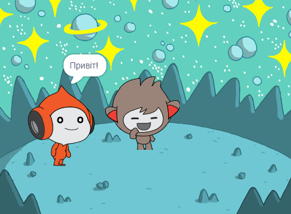
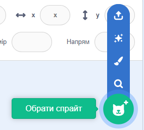
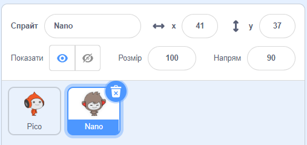
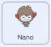
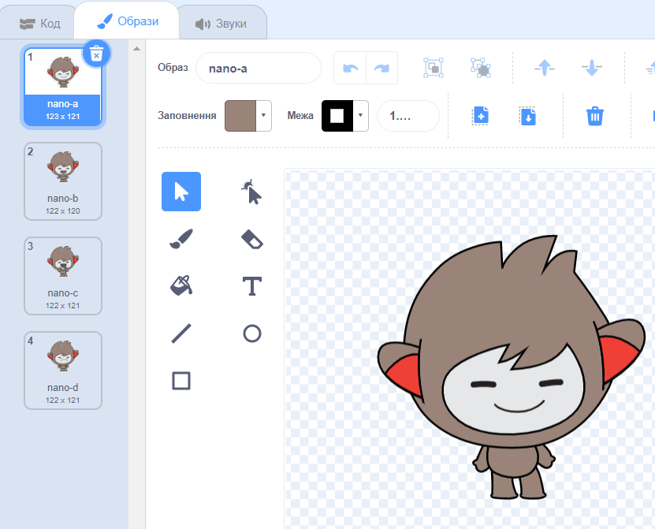
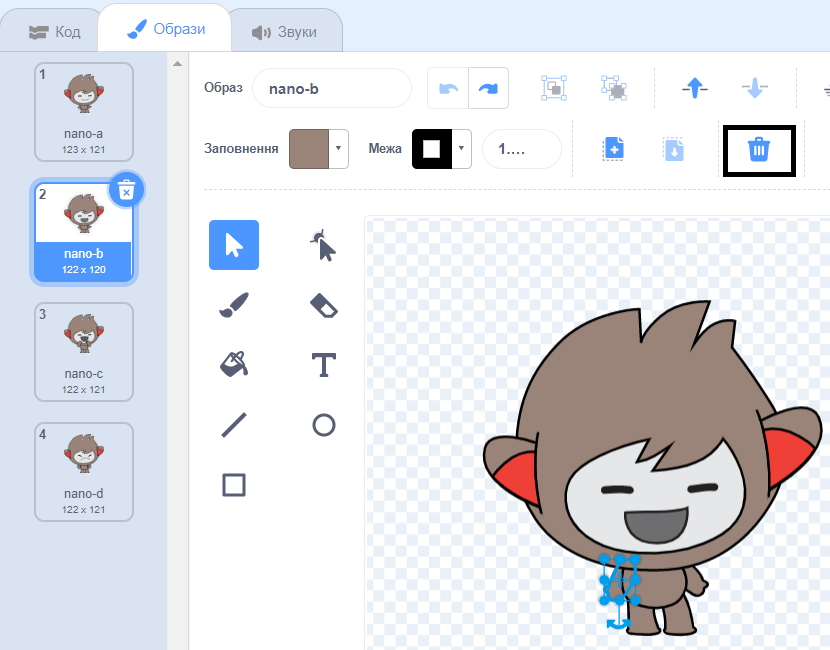
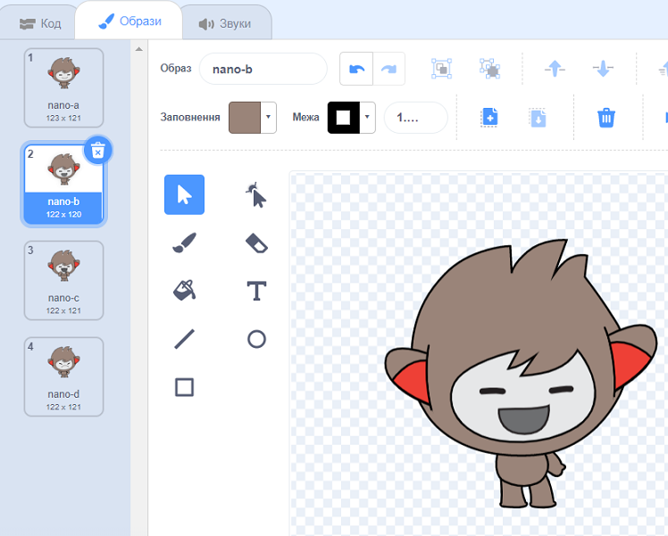
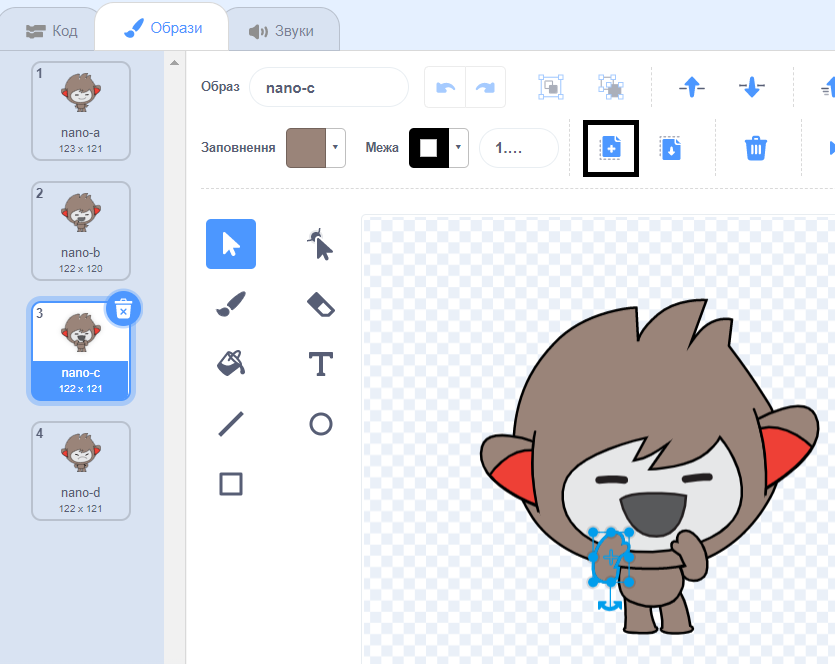
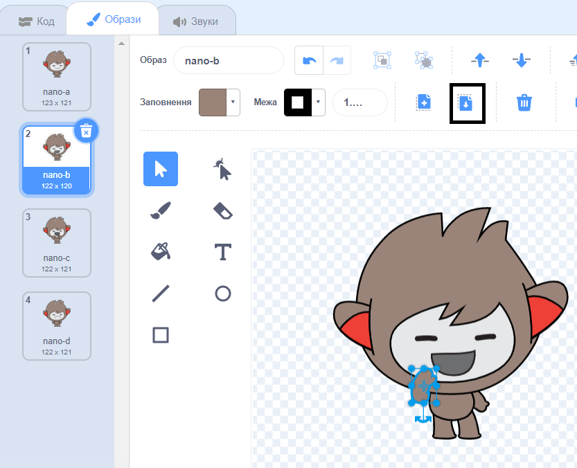

## Nano міняє образи

<div style="display: flex; flex-wrap: wrap">
<div style="flex-basis: 200px; flex-grow: 1; margin-right: 15px;">

Зроби так, щоб Nano емоційно реагував на зміну **образів**.

Спрайти мають **образи**, щоб змінювати їхній вигляд. Щоб анімувати спрайт, можна змінювати його образ.

</div>
<div>

{:width="300px"}

</div>
</div>

### Nano говорить "Дякую!"

> [!TASK]
>
> Додай до проєкту спрайт **Nano** з категорії **Фантазії** category.
>
> 

> [!TASK]
>
> Переконайся, що спрайт **Nano** вибраний у списку Спрайтів під Сценою.
>
> 
>
> Натисни на вкладку **Код** та додай скрипт, щоб змусити спрайт **Nano** сказати 'Дякую', використовуючи блоки `змінити образ на`{:class="block3looks"} та `чекати`{:class="block3control"}:
>
> 
>
> ```blocks3
> when this sprite clicked // коли натиснуто на Nano
> switch costume to [nano-b v] // Nano говорить
> wait (0.5) seconds // спробуй 0.25 замість 0.5
> switch costume to [nano-a v] // Nano посміхається
> ```

**Порада:** Всі блоки мають кольорове позначення, тому ти знайдеш блок `змінити образ на`{:class="block3looks"} у меню блоків `Вигляд`{:class="block3looks"} та блок `чекати`{:class="block3control"} у меню блоків `Вигляд`{:class="block3control"}.

> [!TASK]
>
> **Тест:** Натисни на спрайт **Nano** на Сцені та перевір, чи змінюється костюм Nano.

### Nano використовує мову жестів

<p style="border-left: solid; border-width:10px; border-color: #0faeb0; background-color: aliceblue; padding: 10px;">Мільйони людей використовують жестову мову для спілкування. Поширений спосіб сказати "Дякую" - покласти пальці на підборіддя, тримаючи руку якомога рівніше. Потім потрібно відвести руку вперед, від підборіддя і трохи вниз. 
</p>

<!--- Add a video of someone signing --->

Nano буде використовувати мову жестів, змінюючи образи.

Ти можеш редагувати образи для своїх спрайтів за допомогою редактора Малювання. Ти будеш редагувати образ Nano, щоб змусити його сказати "дякую".

> [!TASK]
>
> Натисни на вкладку **Образи**, щоб побачити образи для спрайта **Nano**:
>
> 

> [!TASK]
>
> Натисни на образ **nano-b**. Натисни на ліву руку, а потім натисни на **Видалити**.
>
> 
>
> Образ має виглядати так:
>
> 

**Порада:** Якщо допущена помилка в редакторі Малювання, можна натиснути на **Скасувати**.


> [!TASK]
>
> Перейди до образу **nano-c** costume та натисни на ліву руку, потім натисни на **Копія**.
>
> 

> [!TASK]
>
> Повернись до образу **nano-b** та клацни **Вставити**. Образ має виглядати так:
>
> 

> [!TASK]
>
> **Тест:** Клацни на спрайт **Nano** на Сцені та переконайся, що з'явилася мовна бульбашка, а образ Nano змінився на образ, який був відредагований.

<p style="border-left: solid; border-width:10px; border-color: #0faeb0; background-color: aliceblue; padding: 10px;">Тепер ти вмієш говорити "дякую" мовою жестів. Наступного разу, коли ти будеш дякувати комусь, чому б не використати своє нове вміння?
</p>
