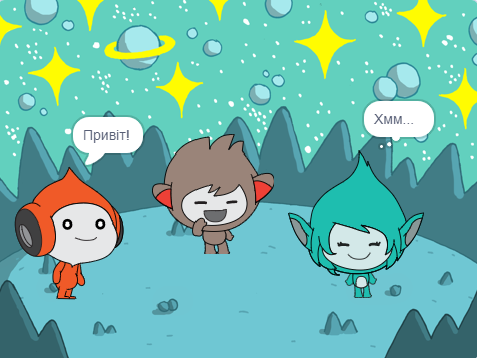

## Giga змінює колір

<div style="display: flex; flex-wrap: wrap">
<div style="flex-basis: 200px; flex-grow: 1; margin-right: 15px;">
Спрайти також можуть використовувати бульбашки думок та змінювати кольори, щоб показати свою індивідуальність. Ти маєш змусити Giga це зробити.
</div>
<div>

{:width="300px"}

</div>
</div>

### Зроби так, щоб Giga змінив колір

--- task ---

Додай спрайт **Giga**.

Перетягни спрайт **Giga** у праву частину Сцени.

--- /task ---

--- task ---

Переконайся, що у тебе є спрайт **Giga**, вибраний у списку Спрайтів під Сценою. Додай цей код, щоб змусити спрайт **Giga** спілкуватися, змінюючи колір:


```blocks3
when this sprite clicked
set [color v] effect to [0] // 0 is the starting colour
think [Hmm...] for [2] seconds 
clear graphic effects // back to the starting colour
```

--- /task ---

**Порада:** Клацни на спрайт у списку Спрайтів під Сценою, перш ніж додавати або змінювати код, образи або звук. Переконайся, що обрано правильний спрайт.

--- task ---

Спробуй різні числа від `1` до `200` у блоці `встановити ефект колір в`{:class="block3looks"} поки не знайдеш колір, який тобі сподобається.

--- /task ---

--- task ---

Зміни слова та кількість секунд у блоці `подумати`{:class="block3looks"}.

--- /task ---

--- task ---

**Тест:** Клацни на спрайт **Giga** на Сцені та переконайся, що спрайт змінює колір і показує бульбашку думок.

--- /task ---

