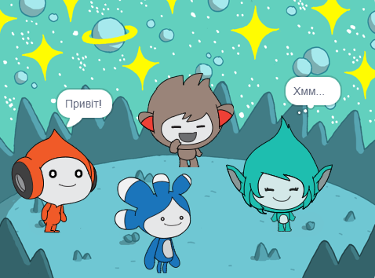

## Вдосконалення твого проєкту

<div style="display: flex; flex-wrap: wrap">
<div style="flex-basis: 200px; flex-grow: 1; margin-right: 15px;">
Додай спрайт **Tera** та використовуй будь-який з блоків, які ти знаєш, щоб додати 'емоцію' спрайта **Tera**.
</div>
<div>

{:width="300px"}

</div>
</div>

Ти також можеш скористатися розширенням Текст у мову, щоб спрайт **Tera** говорив вголос:

[[[scratch3-text-to-speech]]]

Індивідуальність спрайта **Tera** - це твій вибір, тож розважайся, використовуючи власні креативні ідеї.

```blocks3
when this sprite clicked

say [Hello!] for [2] seconds

say [Hello!]

say [] // hide speech bubble

think [Hmm...] for [2] seconds

switch costume to [tera-d v]

wait (1) seconds // 0.5 is half a second

set [color v] effect to [0] // number up to 200

clear graphic effects

play sound [pop v] until done

start sound [pop v]

speak [hello]
```

Ти також можеш 'реміксувати' проєкт, вносячи в нього будь-які зміни на свій розсуд. Ти можеш змінювати тло та емоції спрайтів, і навіть обирати інших спрайтів та додавати їм емоції.

**Порада:** Натисни на спрайт у списку Спрайтів під Сценою, щоб змінити код, образи та звук для цього спрайта.

--- collapse ---
---
title: Сертифікат космічної розмови
---

Молодець! Проєкт Космічна розмова завершений. Ось сертифікат, [a certificate](https://drive.google.com/file/d/18xx4uNIyRSty_2ujHkGDzGwTgfSGC1AF/view?usp=sharing){:target="_blank"}, щоб відсвяткувати твої нові навички. Завантаж копію та відкрий його, щоб додати своє ім'я.

--- /collapse ---

--- collapse ---
---
title: Завершений проєкт
---

Ти можеш переглянути [завершений проєкт тут](https://scratch.mit.edu/projects/485673032/){:target="_blank"}.

--- /collapse ---

--- save ---
