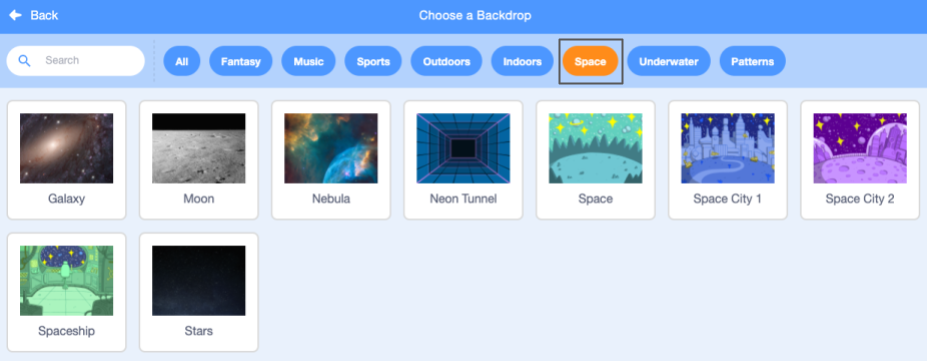
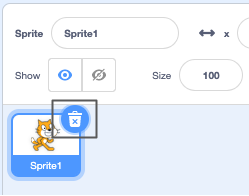
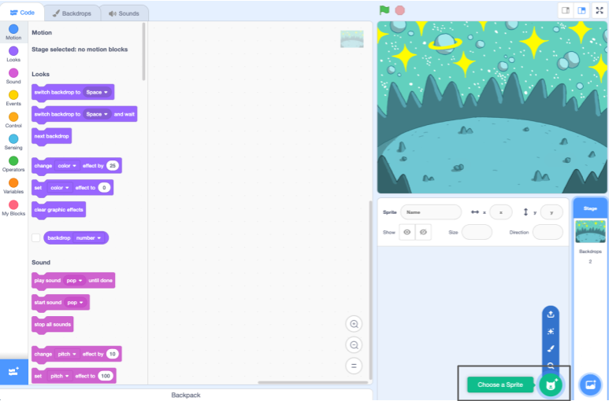

## اپنا منظر بنائیں

اپنے پروجیکٹ کو اسپیس بیک ڈراپ اور پہلے سپرائٹ کے ساتھ ترتیب دیں۔ 

{:width="300px"}

### اسٹارٹر پروجیکٹ کھولیں۔

--- task ---

[اسپیس ٹاک اسٹارٹر پروجیکٹ](https://scratch.mit.edu/projects/582213331/editor){:target="_blank"} کھولیں۔ سکریچ دوسرے براؤزر ٹیب میں کھل جائے گا۔

[[[working-offline]]]

--- /task ---

### سکریچ دوسرے براؤزر ٹیب میں کھل جائے گا۔

### ایک پس منظر شامل کریں۔

**مرحلہ** وہ جگہ ہے جہاں آپ کا پروجیکٹ چلتا ہے۔ ایک **بیک ڈراپ** اسٹیج کی دکھنے کے انداز کو بدل دیتا ہے۔

--- task ---

**پر کلک کریں (یا ٹیبلیٹ پر، ٹیپ کریں) اسٹیج پین میں بیک ڈراپ** کا انتخاب کریں:

--- /task ---

--- task ---

**اسپیس** کیٹیگری پر کلک کریں یا سرچ باکس میں `اسپیس` ٹائپ کریں:

--- /task ---

ہماری مثال میں، ہم نے **اسپیس** بیک ڈراپ کا انتخاب کیا ہے، لیکن وہ بیک ڈراپ منتخب کریں جو آپ کو سب سے زیادہ پسند ہو۔

--- task ---

اسے اپنے پروجیکٹ میں شامل کرنے کے لیے اپنے منتخب کردہ پس منظر پر کلک کریں۔ اسٹیج کو وہ پس منظر دکھانا چاہیے جو آپ نے منتخب کیا ہے:

--- /task ---

### ایک سپرائٹ شامل کریں۔

کیا آپ اس سپرائٹ کو دیکھ سکتے ہیں جو آپ کے پروجیکٹ میں پہلے سے شامل ہے؟ وہ سکریچ بلی ہے۔

--- task ---

**Sprite1** (Scratch Cat) سپرائٹ کو حذف کریں: اسٹیج کے نیچے اسپرائٹ کی فہرست میں **Sprite1** sprite کو منتخب کریں اور **Delete** آئیکن پر کلک کریں۔

--- /task ---

--- task ---

سپرائٹ لسٹ میں **Choose a Sprite** پر کلک کریں:

--- /task ---

--- task ---

**تصور** زمرہ منتخب کریں۔ انہیں اپنے پروجیکٹ میں شامل کرنے کے لیے **پیکو** سپرائٹ پر کلک کریں۔

--- /task ---

--- task ---

**پیکو** سپرائٹ کو گھسیٹ کر اسٹیج کے بائیں جانب رکھیں۔ آپ کا اسٹیج کچھ اس طرح نظر آنا چاہئے:

--- /task ---

--- task ---

**محفوظ کریں**: اگر آپ اپنے سکریچ اکاؤنٹ میں سائن ان ہیں تو سبز ریمکس بٹن پر کلک کریں۔ اس سے پروجیکٹ کی ایک کاپی آپ کے سکریچ اکاؤنٹ میں محفوظ ہو جائے گی۔

اسکرین کے اوپری حصے میں پروجیکٹ کا نام باکس میں اپنے پروجیکٹ کا نام ٹائپ کریں۔

**ٹپ:** اپنے پروجیکٹس کو مددگار نام دیں تاکہ جب آپ کے پاس بہت سارے پروجیکٹ ہوں تو آپ انہیں آسانی سے تلاش کر سکیں۔

اگلا، اپنے پروجیکٹ کو بچانے کے لیے **فائل**پر کلک کریں، اور پھر **Save now** پر کلک کریں۔

اگر آپ آن لائن نہیں ہیں یا آپ کے پاس سکریچ اکاؤنٹ نہیں ہے، تو آپ اپنے پروجیکٹ کی کاپی محفوظ کرنے کے لیے **اپنے کمپیوٹر پر محفوظ کریں** پر کلک کر سکتے ہیں۔

--- /task ---

