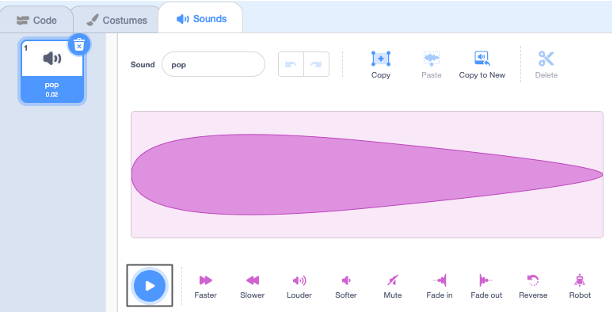
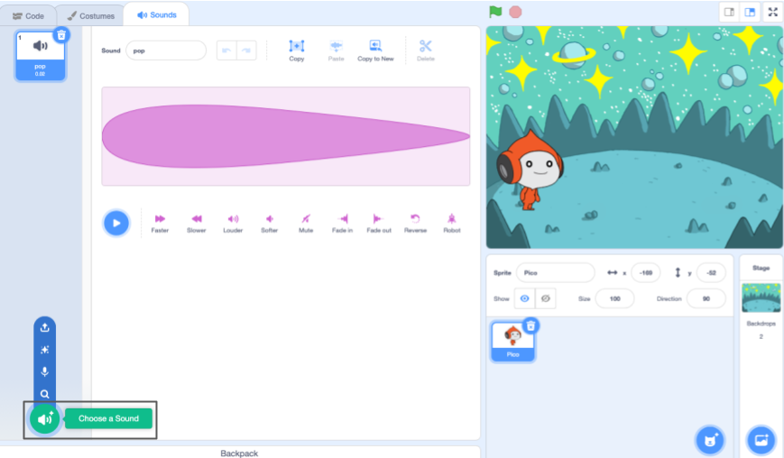

## یہ کوڈ سپرائٹ کا رنگ بدلتا ہے اور سوچ کا بلبلہ دکھاتا ہے۔

<div style="display: flex; flex-wrap: wrap">
<div style="flex-basis: 200px; flex-grow: 1; margin-right: 15px;">
بات چیت کرنے کا دوسرا طریقہ آواز کا استعمال کرنا ہے۔
</div>
<div>

{:width="300px"}

</div>
</div>

### پیکو سپرائٹ میں آواز شامل کریں۔

--- task ---

**پیکو** سپرائٹ کے لیے **ساؤنڈز** ٹیب پر کلک کریں اور آپ کو **پاپ** ساؤنڈ ملے گا۔ **پاپ** آواز سننے کے لیے **پلے** آئیکن پر کلک کریں۔



**ڈیبگ**: اگر آپ آواز نہیں سن سکتے تو چیک کریں کہ آواز آپ کے کمپیوٹر یا ٹیبلیٹ پر کام کر رہی ہے۔

--- /task ---

--- task ---

نئی آواز کا انتخاب کرنے کے لیے، **Choose a Sound** آئیکن پر کلک کریں اور **Space** زمرہ منتخب کریں یا سرچ باکس میں `space` ٹائپ کریں۔





--- /task ---

--- task ---

**پلے** آئیکنز کا استعمال کرتے ہوئے کچھ مختلف آوازیں چلائیں۔ ایک بار جب آپ کو وہ آواز مل جائے جسے آپ استعمال کرنا چاہتے ہیں، اسے اپنے پروجیکٹ میں شامل کرنے کے لیے اس پر کلک کریں۔


--- /task ---

### کلک کرنے پر پیکو ٹاک بنائیں (یا ٹیپ کریں)

--- task ---

**کوڈ** ٹیب پر کلک کریں۔ `ساؤنڈ`{:class="block3sound"} بلاکس مینو میں، `اسٹارٹ ساؤنڈ`{:class="block3sound"} بلاک تلاش کریں۔

بلاک کو کوڈ کے علاقے میں گھسیٹیں، `کے درمیان جب اس سپرائٹ نے`{:class="block3events"} بلاک پر کلک کیا اور `کہتے ہیں`{:class="block3looks"} بلاک۔ ایک خلا کھل جائے گا اور بلاک جگہ پر آجائے گا۔


پروجیکٹ اس طرح نظر آنا چاہئے:


```blocks3
when this sprite clicked
+start sound [Alien Creak1 v] 
say [Hello!] for [2] seconds // hide speech after 2 seconds
```

--- /task ---

### اپنے کوڈ کی جانچ کریں۔

--- task ---

چیک کریں کہ آپ کے `اسٹارٹ ساؤنڈ`{:class="block3sound"} بلاک میں آپ کی منتخب آواز موجود ہے۔ اگر ایسا نہیں ہوتا ہے تو، آپ کو `اسٹارٹ ساؤنڈ`{:class="block3sound"} بلاک میں موجود آواز پر کلک کرنے کی ضرورت ہے، پھر ڈراپ ڈاؤن مینو میں اپنی منتخب کردہ آواز کو منتخب کریں۔


--- /task ---

--- task ---

**ٹیسٹ:** **پیکو** اسپرائٹ پر کلک کریں اور چیک کریں کہ اسپیچ بلبلہ ظاہر ہوتا ہے اور آپ آواز سن سکتے ہیں۔ اگر آپ کو آواز سنائی نہیں دیتی ہے، تو یقینی بنائیں کہ آپ نے `کے نیچے <code>اسٹارٹ ساؤنڈ`{:class="block3sound"} بلاک شامل کیا ہے جب اس سپرائٹ نے</code>{:class="block3events"} بلاک پر کلک کیا۔

--- /task ---

