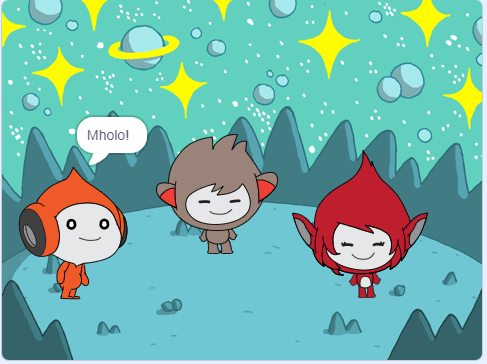

## Uya kwenza

Yenza indawo yendawo enabalinganiswa 👾 'emote' ukwabelana ngeengcinga okanye iimvakalelo zabo.

Kwi-Scratch, iimpawu kunye nezinto zibizwa ngokuba yi **sprites**, kwaye zivela kwi- **Stage**.

Uza ku:
+ Yongeza i-sprites kunye ne- **yangasemva** ukuseta iprojekthi yakho
+ Cofa kwi-sprites ukubenza banxibelelane usebenzisa i `Looks`{:class="block3looks"} kunye no `Isandi`{:class="block3sound"} iibhloko zekhowudi
+ Sebenzisa i **Peyinta umhleli** ukutshintsha isinxibo esi ****

--- no-print ---
--- task ---
### Dlala ▶️

  
Cofa kwi-sprite nganye ukuze ubone into abayenzayo. 

Kwenzeka ntoni ukuba ucofa kwi-sprite esinye kwaye ucofe ngokukhawuleza kwesinye i-sprite?

  <iframe allowtransparency="true" width="485" height="402" src="https://scratch.mit.edu/projects/embed/913597736/?autostart=false" frameborder="0"></iframe>

--- /task ---
--- /no-print ---

--- print-only ---

--- /print-only ---

