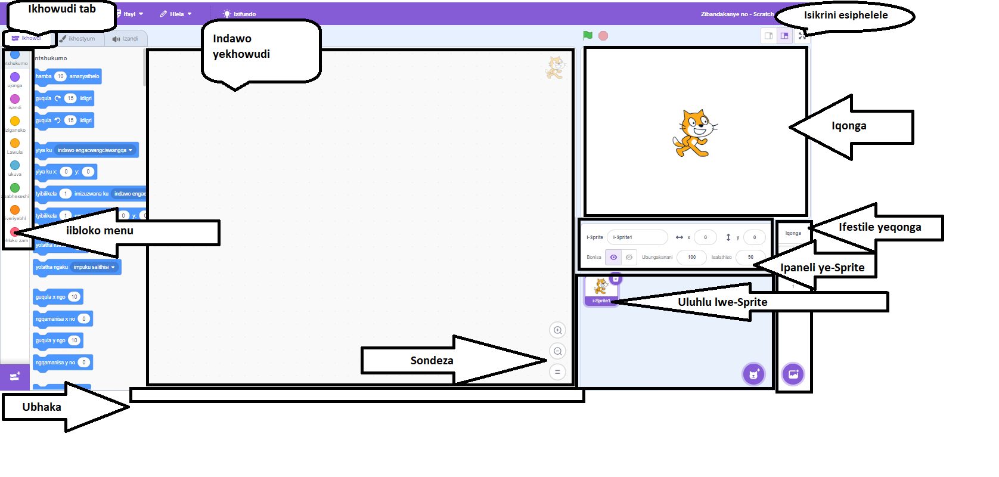
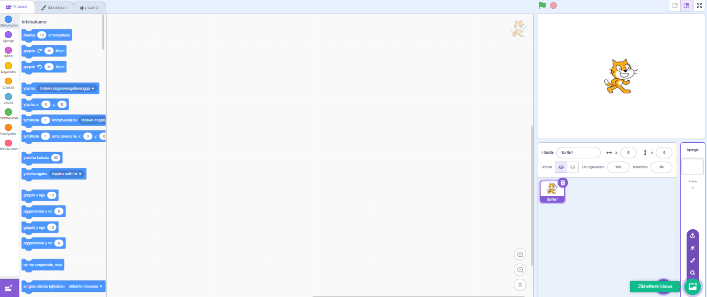
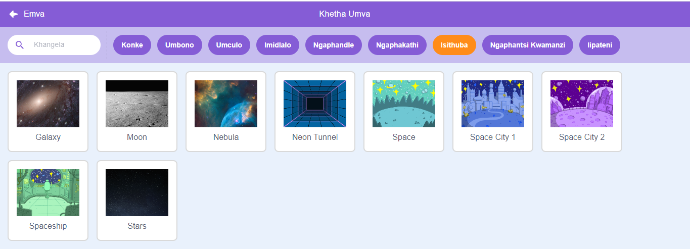
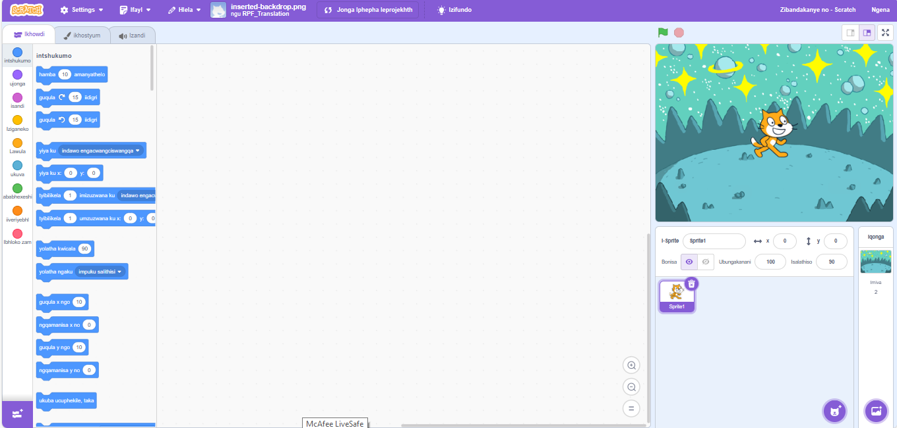
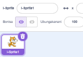
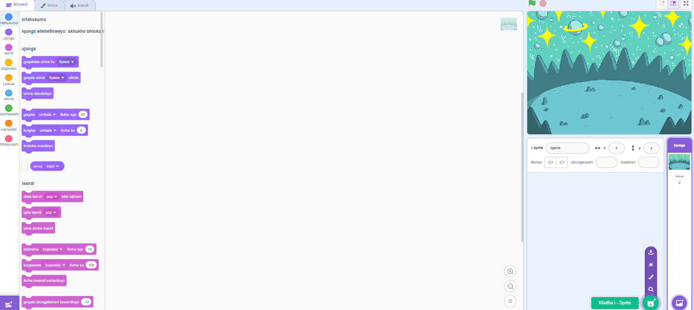
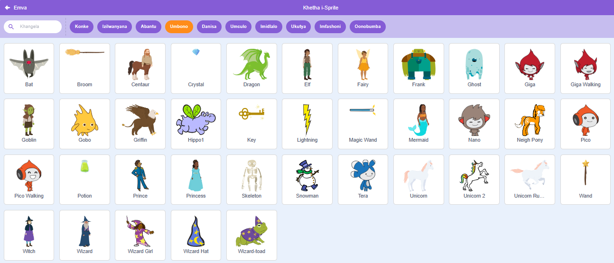
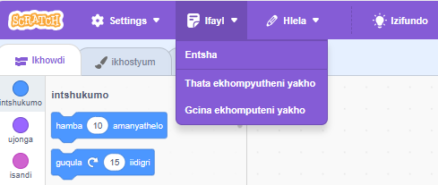

## Yenza umboniso wakho

Seta iprojekthi yakho kwindawo engasemva kunye ne-sprite sokuqala. 

{:width="300px"}

### Vula iprojekthi yokuqalisa

--- task ---

Vula i [Iprojekthi yokuqalisa intetho yesikhala](https://scratch.mit.edu/projects/582213331/editor){:target="_blank"}. Scratch uya kuvula kwenye ithebhu yesikhangeli.

[[[working-offline]]]

--- /task ---

### Umhleli weScratch

### Yongeza umva

I**qonga** kulapho iprojekthi yakho iqhuba khona. I **yangasemva** iyayitshintsha indlela ejongeka ngayo iqonga.

--- task ---

Cofa (okanye kwithebhulethi, cinezela) ku- **Khetha iNdawo yangasemva** kwiFestile yeqonga:

--- /task ---

--- task ---

Cofa ku **isithuba** udidi okanye uchwetheze u- `isithuba sesi` kwibhokisi yokukhangela:

--- /task ---

Kumzekelo wethu, sikhethe i **Space** ngasemva, kodwa khetha i-backdrop oyithanda kakhulu.

--- task ---

Cofa kwindawo yangasemva oyikhethileyo ukuyongeza kwiprojekthi yakho. Iqonga kufuneka libonise umva owukhethileyo:

--- /task ---

### Yongeza i-Sprite

Ngaba uyasibona i-sprite esele sifakiwe kwiprojekthi yakho? Leyo yiKati ka Scratch.

--- task ---

Cima i **Sprite1** (Scratch Cat) sprite: khetha i **Sprite1** sprite kuluhlu lwe-Sprite ngaphantsi kweSigaba kwaye ucofe ku **Cima i** icon.

--- /task ---

--- task ---

Cofa ku **Khetha i-Sprite** kuluhlu lwe-Sprite:

--- /task ---

--- task ---

Khetha i **Fantasy** udidi. Cofa ku **Pico** sprite ukubongeza kwiprojekthi yakho.

--- /task ---

--- task ---

Tsala i **Pico** sprite ukuze uzibeke kwicala lasekhohlo leNqanaba. Inqanaba lakho kufuneka lijonge ngolu hlobo:

--- /task ---

--- task ---

**Gcina**: Ukuba usayinelwe kwi-akhawunti yakho ye-Scratch, cofa kwiqhosha eliluhlaza Remix. Oku kuya kugcina ikopi yeprojekthi kwi-akhawunti yakho yeScratch.

Chwetheza igama leprojekthi yakho kwibhokisi yegama leprojekthi phezulu kwesikrini.

**Ingcebiso:** Nika iiprojekthi zakho amagama aluncedo ukuze ukwazi ukuzifumana lula xa uneeprojekthi ezininzi.

Okulandelayo, cofa ku **Ifayile**, kwaye emva koko ku **Gcina ngoku** ukugcina iprojekthi yakho.

Ukuba awukho kwi- intanethi okanye awunayo iakhawunti yeScratch, ungacofa ku **Gcina kwikhompyuter yakho** ukugcina ikopi yeprojekthi yakho.

--- /task ---

