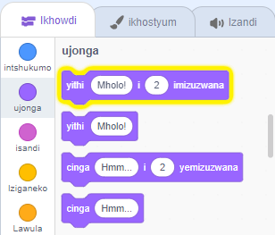
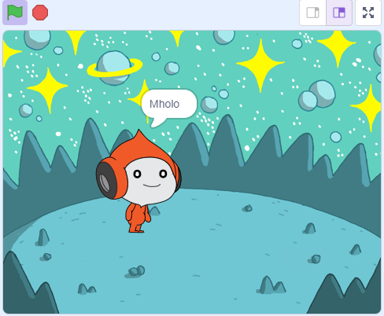
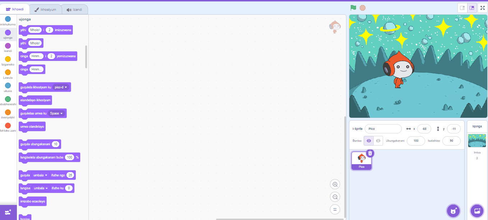
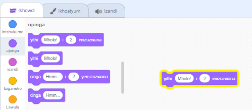
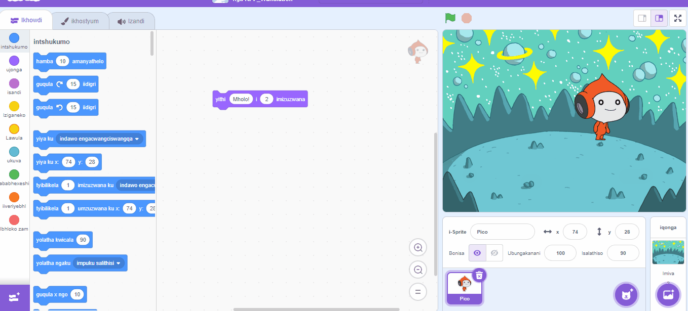
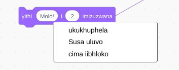

## Pico uthi molo

<div style="display: flex; flex-wrap: wrap">
<div style="flex-basis: 200px; flex-grow: 1; margin-right: 15px;">
I-sprite inokuba nekhowudi, isinxibo, kunye nezandi zokutshintsha indlela ekhangeleka ngayo kunye nento eyenzayo. 
  
I-sprite inokuba nekhowudi, isinxibo, kunye nezandi zokutshintsha indlela ekhangeleka ngayo kunye nento eyenzayo. 
  
Yongeza iibhloko zekhowudi ukwenza i-Pico ivakale ngamagama kunye nesandi xa i-sprite icofa.
</div>
<div>

{:width="300px"}

</div>
</div>

<p style="border-left: solid; border-width:10px; border-color: #0faeb0; background-color: aliceblue; padding: 10px;">
<span style="color: #0faeb0">**Iimvakalelo**</span> yindlela yokubonisa ubuntu bomlinganiswa kumdlalo. Bangasebenzisa intetho, izandi, intshukumo, kunye neziphumo zemizobo, njengakwiScratch. Ngaba uyayidlala nayiphi na imidlalo esebenzisa iimvakalelo?
</p>

### Sebenzisa ibhloko kayithi

--- task ---

Vula i `imbonakalo`{:class="block3looks"} iibhloko zemenyu.

Cofa ku- `kuyithi`{:class="block3looks"} `Molo!` `for`{:class="block3looks"} `2` `imizuzwana`{:class="block3looks"} block.



I **Pico** sprite iya kubonisa iqamza lentetho imizuzwana emibini.



**Ingcebiso: Iibhloko zekhowudi** kwiScratch zikhazimla ngolwandlalo olutyheli xa zibaleka.

--- /task ---

--- task ---

Tsala u `yithi`{:class="block3looks"} `Molo!` `for`{:class="block3looks"} `2` `imizuzwana`{:class="block3looks"} ibhloko kwindawo yeKhowudi. Cofa kuyo kwakhona.





--- /task ---

### Yenza uPico athethe xa ucofa (okanye ucofa)

--- task ---

Tsala i- `xa le sprite icofa i`{:class="block3events"} ibhlokhi esuka kwi `Iziganeko`{:class="block3events"} iibhloko zemenyu kwaye uyidibanise phezulu kwe `yakho ithi`{:class="block3looks"} bhloka kwindawo yeKhowudi. Iibhloko ziya kuqhawuka kunye.




```blocks3
+when this sprite clicked
say [Hello!] for [2] seconds // hide speech after 2 seconds
```

--- /task ---

### Izimvo zekhowudi

--- task ---

```blocks3
say [Hello!] for [2] seconds // hide speech after 2 seconds
```
Uya kubona izimvo kwimizekelo yekhowudi. Awudingi ukongeza izimvo xa usongeza ikhowudi kwiprojekthi yakho.

Ukuba unexesha xa ugqibile iprojekthi yakho, luluvo oluhle ukongeza izimvo kwikhowudi yakho ukuze kube lula ukuyiqonda kamva. Try adding a comment now. Right-click (or on a tablet, tap and hold) on a block in the Code area and choose **Add Comment**.



--- /task ---

### Uvavanyo

--- task ---

**Uvavanyo:** Cofa kwi- **Pico** sprite kwi-qonga kwaye ukhangele ukuba iqamza lentetho livela kwimizuzwana emibini. Kubalulekile ukuvavanya ikhowudi yakho ukuze uqiniseke ukuba iyayenza le nto uyilindeleyo.

--- /task ---

--- task ---

Sele uyigcinile iprojekthi yakho kwaye uyinike igama. I-Scratch ngoku iya **ngokuzenzekelayo** ikugcinele.

Usenako ukucofa ugcine ukuba uyathanda, ukuze uqinisekise.

--- /task ---
