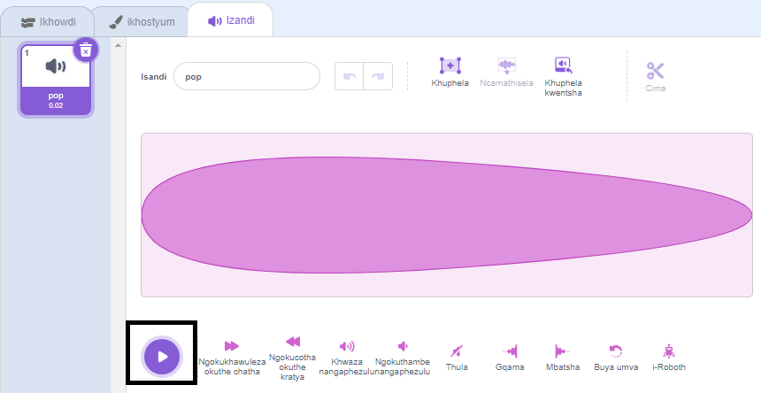
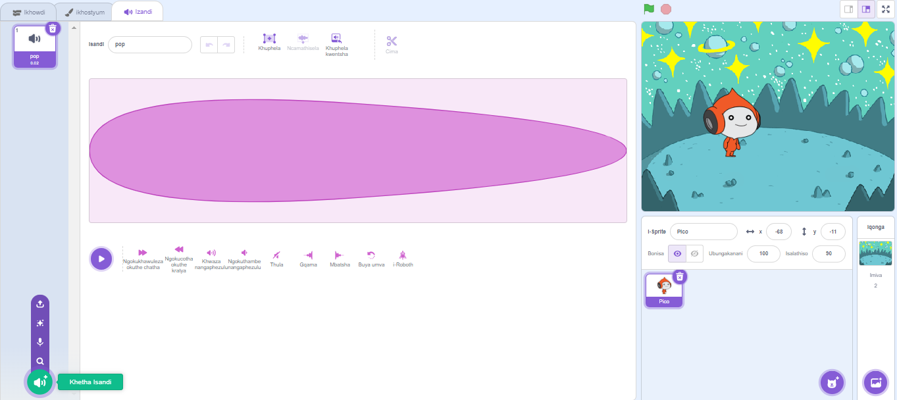
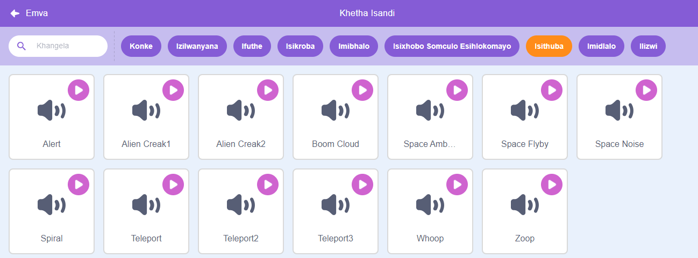
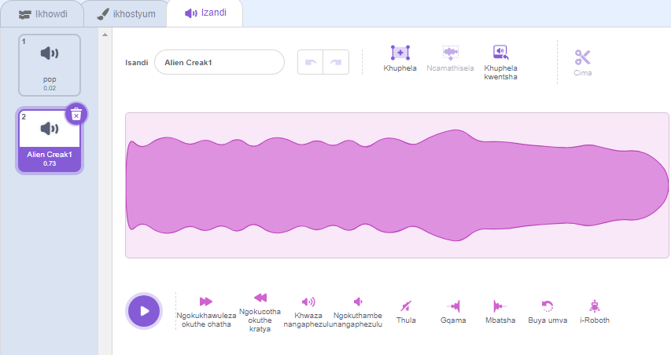
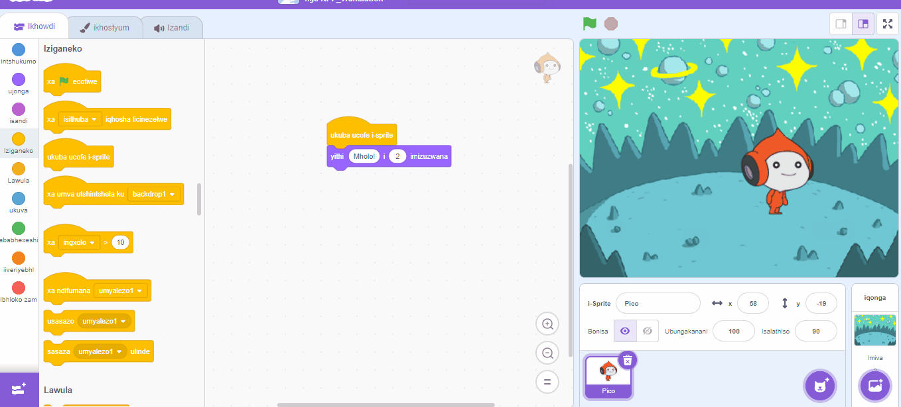
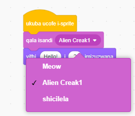

## Upico udlala isandi

<div style="display: flex; flex-wrap: wrap">
<div style="flex-basis: 200px; flex-grow: 1; margin-right: 15px;">
Enye indlela yokunxibelelana kukusebenzisa isandi.
</div>
<div>

{:width="300px"}

</div>
</div>

### Yongeza isandi kwiPico Sprite

--- task ---

Cofa ku **Izandi** ithebhu ye- **Pico** sprite kwaye uya kufumana i **pop** isandi. Cofa ku **Play** icon ukuva isandi se **pop**.



**Debug**: Ukuba awusiva isandi jonga ukuba isandi siyasebenza kwikhompyuter yakho okanye kwithebhulethi.

--- /task ---

--- task ---

Ukukhetha isandi esitsha, cofa kwindawo ethi **Khetha i-icon yesandi** kwaye ukhethe i- **Space** udidi okanye uchwetheze isithuba sesi</code> `yokukhangela.</p>

<p spaces-before="0"></p>

<p spaces-before="0"></p>

<p spaces-before="0"></p>

<p spaces-before="0">--- /task ---</p>

<p spaces-before="0">--- task ---</p>

<p spaces-before="0">Dlala izandi ezimbalwa ezahlukeneyo usebenzisa i <strong x-id="1">Play</strong>icons. Nje ukuba ufumene isandi ofuna ukusisebenzisa, cofa kuso ukuze uyongeze kwiprojekthi yakho.</p>

<p spaces-before="0"></p>

<p spaces-before="0">--- /task ---</p>

<h3 spaces-before="0">Yenza isandi sidlale xa ucofa (okanye ucofa)</h3>

<p spaces-before="0">--- task ---</p>

<p spaces-before="0">Cofa kwi <strong x-id="1">Code</strong> thebhu. Kwi <code>Sound`{:class="block3sound"} iibhloko zemenyu, fumana i `isiqalo sesandi`{:class="block3sound"} bhloko.

Tsala ibhloko kwindawo yeKhowudi, phakathi kwe- `xa esi-sprite sicofwa`{:class="block3events"} ibhloko kunye no `athi`{:class="block3looks"} ibhloko. Isikhewu siya kuvuleka kwaye ibhloko iya kungena endaweni yayo.



Ikhowudi yakho kufuneka ijongeke ngolu hlobo:


```blocks3
when this sprite clicked
+start sound [Alien Creak1 v] 
say [Hello!] for [2] seconds // hide speech after 2 seconds
```

--- /task ---

### Vavanya ikhowudi yakho

--- task ---

Jonga ukuba `yakho yokuqala isandi`{:class="block3sound"} ibhloko inesandi osikhethileyo kuyo. Ukuba ayenzi njalo, kufuneka ucofe isandi kwi `yokuqalisa isandi`{:class="block3sound"} bhloko, emva koko ukhethe isandi osikhethileyo kwimenyu eyehlayo.



--- /task ---

--- task ---

**Uvavanyo:** Cofa kwi- **Pico** sprite kwaye ujonge ukuba iqamza lentetho liyavela kwaye unokuva isandi. Ukuba awusiva isandi, qiniseka ukuba wongeze i `isandi sokuqala`{:class="block3sound"} ibhloko phantsi ko- `xa Isprite sicofwa `{:class="block3events"} bhloko.

--- /task ---

