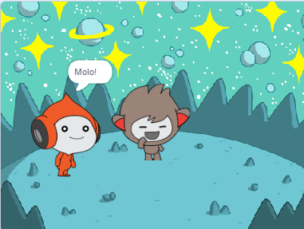
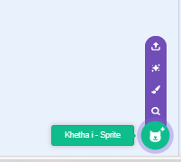
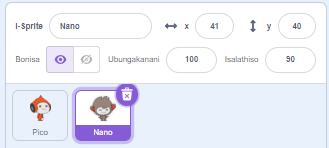
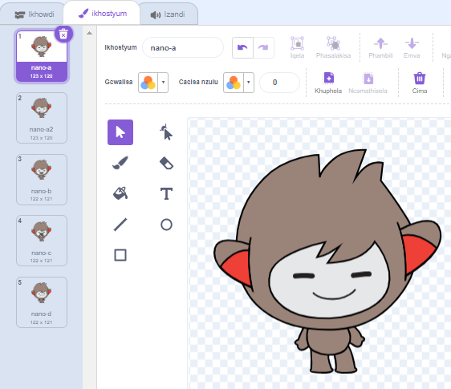
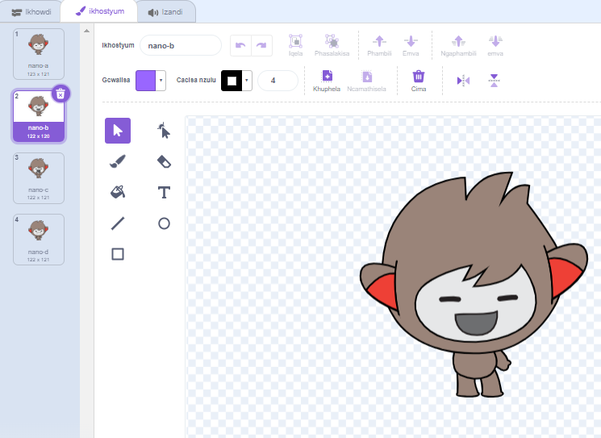
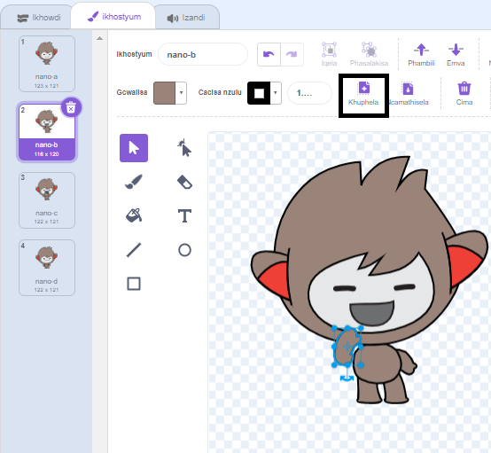
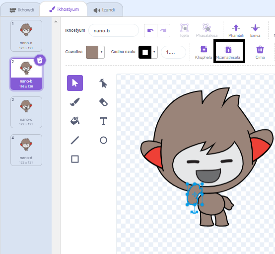

## Unano utshintsha isinxibo

<div style="display: flex; flex-wrap: wrap">
<div style="flex-basis: 200px; flex-grow: 1; margin-right: 15px;">

Fumana uNano imvakalelo ngokutshintsha **isinxibo**.

I-Sprites ine-*impahla** yokutshintsha indlela ekhangeleka ngayo. Ukuvuselela i-sprite, ungatshintsha isinxibo sayo.

</div>
<div>

{:width="300px"}

</div>
</div>

### U-Nano uphawula "Enkosi!"

--- task ---

Yongeza i **Nano** sprite kwiprojekthi yakho ukusuka kwinqanaba le **Fantasy**uluhlu.



--- /task ---

--- task ---

Qinisekisa ukuba i **Nano** sprite ikhethiwe kuluhlu lwe-Sprite ngaphantsi kwe-Stage.




Cofa kwi **Code** ithebhu kwaye wongeze iskripthi ukufumana i **Nano** sprite ukusayina 'Enkosi' usebenzisa `tshintsha isinxibo ukuya kwi`{:class="block3looks"} kunye `linda`{:class="block3control"}:


```blocks3
when this sprite clicked // xa kucofa uNano
switch costume to [nano-b v] // Nano ethetha
wait (0.5) seconds // zama 0.25 endaweni ka 0.5
switch costume to [nano-a v] // Nano encumile
```
--- /task ---

**Ingcebiso:** Zonke iibhloko zinekhowudi yombala, ngoko ke uya kufumana i `yokutshintshela isinxibo ukuya ku`{:class="block3looks"} ibhloko kwi `Looks`{:class="block3looks"} iibhloko zemenyu kunye nokulinda ka `yima`{:class="block3control"} ibhloko kwi- `Control`{:class="block3control"} iibhloko zemenyu.

--- task ---

**Uvavanyo:** Cofa kwi **Nano** sprite kwi-Stage kwaye ukhangele ukuba iimpahla zikaNano ziyatshintsha.

--- /task ---

### Unano usebenzisa intetho yezandla

<p style="border-left: solid; border-width:10px; border-color: #0faeb0; background-color: aliceblue; padding: 10px;">Izigidi zabantu zisebenzisa intetho yezandla ukuze zinxibelelane. Indlela eqhelekileyo yokusayina 'Enkosi' kukubeka iminwe yakho esilevini ngesandla sakho sicaba kangangoko. Emva koko uhambise isandla sakho phambili, kude nesilevu sakho kwaye uhle kancinci. 
</p>

<!--- Add a video of someone signing --->

Unano uza kusebenzisa intetho yezandla ngokutshintsha iimpahla.

Ungahlela iimpahla zesprites zakho ngomhleli wePaint. Uya kuhlela isinxibo sikaNano ukuze ubenze basayine "enkosi".

--- task ---

Cofa kwi **Isinxibo se** ithebhu ukubona iimpahla ze **Nano** sprite:



--- /task ---

--- task ---

Cofa kwi **nano-b** impahla. Cofa kwingalo kwicala lasekhohlo, kwaye emva koko ucofe ku **Cima i**.


Isinxibo kufuneka sijonge ngolu hlobo:



--- /task ---

**Ingcebiso:** Ukuba wenza impazamo kumhleli wePeyinti, ungacofa ku **Hlehlisa isi**.


--- task ---

Yiya kwi-costume ye **nano-c** kwaye nqakraza kwingalo kwicala lasekhohlo, uze ucofe kwi **ikopi**.



--- /task ---

--- task ---

Buyela kwi **nano-b** costume kwaye nqakraza kwi **Namathisela**. Isinxibo kufuneka sijonge ngolu hlobo:



--- /task ---

--- task ---

**Vavanya:** Cofa kwi **Nano** sprite kwi-qonga kwaye ukhangele ukuba iqamza lentetho livela kwaye i-costume kaNano iyatshintsha kwisinxibo osihlelileyo.

--- /task ---

<p style="border-left: solid; border-width:10px; border-color: #0faeb0; background-color: aliceblue; padding: 10px;">Ufundile indlela yokusayina "enkosi". Kwixesha elizayo xa ubulela umntu, kutheni ungasebenzisi ubuchule obutsha?
</p>

