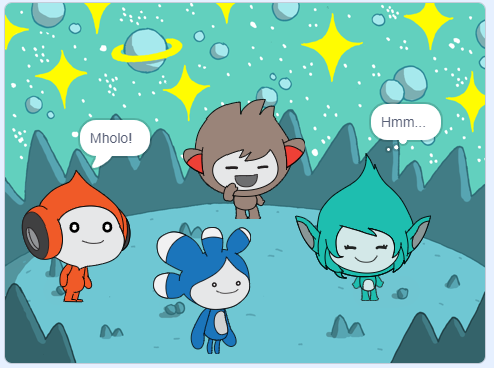

## Phucula iprojekthi yakho

<div style="display: flex; flex-wrap: wrap">
<div style="flex-basis: 200px; flex-grow: 1; margin-right: 15px;">
Yongeza i-**Tera** sprite kwaye usebenzise naziphi na iibhloko ozifundileyo malunga nokwenza 'i-emote' ye-**Tera** sprite.
</div>
<div>

{:width="300px"}

</div>
</div>

Ungasebenzisa kwakhona iSibhalo kwiNtetho ukongezwa ukwenza **uTera** athethe ngokuvakalayo:

[[[scratch3-text-to-speech]]]

Ubuntu be **Tera** sprite lukhetho lwakho, ke yonwaba usebenzisa ezakho izimvo zokuyila.

```blocks3
when this sprite clicked

say [Hello!] for [2] seconds

say [Hello!]

say [] // hide speech bubble

think [Hmm...] for [2] seconds

switch costume to [tera-d v]

wait (1) seconds // 0.5 is half a second

set [color v] effect to [0] // number up to 200

clear graphic effects

play sound [pop v] until done

start sound [pop v]

speak [hello]
```

Unako kwakhona 'ukuxuba' iprojekthi ukwenza naluphi na utshintsho oluthandayo. Unokutshintsha i-backdrop, kunye nendlela i-sprites emote ngayo, kwaye ukhethe i-sprites eyahlukeneyo kwaye ubanike i-emotes.

**Ingcebiso:** Cofa kwi-sprite kuluhlu lweSprite ngezantsi kweQonga ukutshintsha ikhowudi, iimpahla, kunye nesandi saloo sprite.

--- collapse ---
---
title: Isatifikethi se-spacetalk
---

Wenze kakuhle! Uyigqibile iprojekthi yokuthetha ngeSithuba. Nasi u- [isatifikethi](https://drive.google.com/file/d/18xx4uNIyRSty_2ujHkGDzGwTgfSGC1AF/view?usp=sharing){:ithagethi="_blank"} ukubhiyozela izakhono zakho ezitsha. Khuphela ikopi uze uyivule uze wongeze igama lakho.

--- /collapse ---

--- collapse ---
---
title: Iprojekthi egqityiweyo
---

Ungajonga i [projkthi engqityweyo apha](https://scratch.mit.edu/projects/913597736/){:target="_blank"}.

--- /collapse ---

--- save ---
