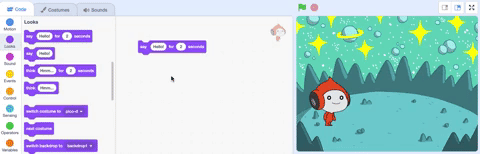

## U-Pico uthi sawubona

<div style="display: flex; flex-wrap: wrap">
<div style="flex-basis: 200px; flex-grow: 1; margin-right: 15px;">
I-sprite ingaba nekhodi, imvunulo, nemisindo ukuze iguqule indlela ebukeka ngayo nokuthi yenzani. 
  
Engeza amabhulokhi ekhodi ukuze wenze u-Pico ezwakale ngamagama nomsindo uma i-sprite ichofozwa.
</div>
<div>

{:width="300px"}

</div>
</div>

<p style="border-left: solid; border-width:10px; border-color: #0faeb0; background-color: aliceblue; padding: 10px;">
<span style="color: #0faeb0">**Ama-Emotes**</span> ayindlela yokubonisa ubuntu bomlingisi kwigemu. Bangasebenzisa inkulumo, imisindo, ukunyakaza, nemiphumela eyingcaca, njengaku-Scratch. Ingabe udlala noma yimiphi imidlalo esebenzisa izithonjana?
</p>

### Sebenzisa i-block ethi 'say'

--- task ---

Vula `ama-Looks`{:class="block3looks"} imenyu yamabhulokhi.

Chofoza kokuthi `say`{:class="block3looks"} `Sawubona!` `for`{:class="block3looks"} `2` `imizuzwana`{:class= "block3looks"} bhulokhi.


I- **Pico** sprite izobonisa ibhamuza lenkulumo imizuzwana emibili.


**Ithiphu:** Amabhulokhi ekhodi ku-Scratch akhanya ngohlaka oluphuzi uma esebenza.

--- /task ---

--- task ---

Chofoza kokuthi `say`{:class="block3looks"} `Sawubona!` `for`{:class="block3looks"} `2` `imizuzwana`{:class= "block3looks"} bhulokhi. Chofoza kuso futhi.


--- /task ---

### Yenza u-Pico ekhulume lapho echofozwa (noma ethephwa)

--- task ---

Khetha `when this sprite clicked`{:class="block3events"} ibhulokhi kuma`event`{:class="block3events"} imenyu yamabhulokhi futhi uxhume ngaphezulu kwebhulokhi lakho elithi `say`{:class="block3looks"} endaweni Yekhodi. Amabhulokhi azoxhumana ndawonye.




```blocks3
+when this sprite clicked
say [Hello!] for [2] seconds // hide speech after 2 seconds
```

--- /task ---

### Amakhomente ekhodi

--- task ---

```blocks3
say [Hello!] for [2] seconds // hide speech after 2 seconds
```
Uzobona amakhomente ayizibonelo zekhodi. Awudingi ukwengeza amakhomenti lapho wengeza khona ikhodi kuphrojekthi yakho.

Uma unesikhathi lapho usuqedile iphrojekthi yakho, kuwumqondo omuhle ukwengeza amakhomenti kukhodi yakho ukuze kube lula ukuyiqonda kancono. Try adding a comment now. Right-click (or on a tablet, tap and hold) on a block in the Code area and choose **Add Comment**.


--- /task ---

### Isivivinyo

--- task ---

**Test:** Click on the **Pico** sprite on the Stage and check that the speech bubble appears for two seconds. It is important to test your code to make sure that it does what you expect.

--- /task ---

--- task ---

You have already saved your project and given it a name. Scratch will now **automatically** save for you.

You can still click save if you like, just to make sure.

--- /task ---
